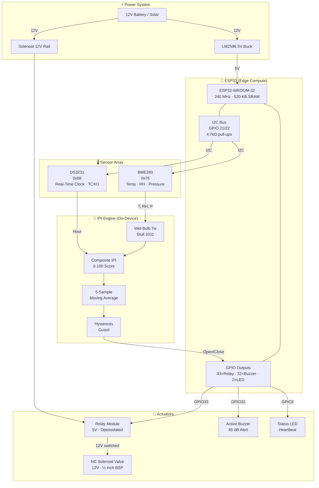

# ❄️ Ice Stupa Autonomous Irrigation Controller
### Edge-Computed Ice Potential Index (IPI) Engine — ESP32 Firmware

> **An open-source, fully offline environmental station that predicts freeze potential in high-altitude cold deserts and autonomously controls water flow to maximise artificial glacier (Ice Stupa) operational seasons.**

[](https://www.espressif.com/)
[](https://isocpp.org/)
[](LICENSE)
[]()

---

## Table of Contents

1. [Project Overview](#1-project-overview)
2. [System Validity & Scientific Basis](#2-system-validity--scientific-basis)
3. [IPI Algorithm Deep Dive](#3-ipi-algorithm-deep-dive)
4. [Bill of Materials (BOM)](#4-bill-of-materials-bom)
5. [Absolute Pin Mapping Table](#5-absolute-pin-mapping-table)
6. [Point-to-Point Wiring Netlist](#6-point-to-point-wiring-netlist)
7. [Hardware Block Diagram](#7-hardware-block-diagram)
8. [Firmware Architecture](#8-firmware-architecture)
9. [Firmware Configuration Reference](#9-firmware-configuration-reference)
10. [Flashing Instructions](#10-flashing-instructions)
11. [Calibration & Testing Plan](#11-calibration--testing-plan)
12. [Serial Log Interpretation](#12-serial-log-interpretation)
13. [Deployment Checklist](#13-deployment-checklist)
14. [Rapid Microclimate Transition Handling](#14-rapid-microclimate-transition-handling)
15. [Future Improvements](#15-future-improvements)
16. [References](#16-references)

---

## 1. Project Overview

Artificial glaciers (*Ice Stupas*), pioneered by Sonam Wangchuk in Ladakh, India, are cone-shaped ice reservoirs constructed by spraying pressurised meltwater through a vertical pipe during winter. The water freezes on contact with cold night air, building a 10–30 m tall ice cone that stores water for spring irrigation.

**The core problem:** During shoulder seasons (early winter / late spring), daytime temperatures rise above 0 °C while nights remain sufficiently cold. Manually controlling water flow is impractical at remote, unmanned sites. Spraying during a warm period causes structural melting and collapses months of ice accumulation.

**This system solves it by:**

- Continuously sampling temperature, humidity, and pressure every 30 seconds using a BME280 sensor.
- Computing a composite **Ice Potential Index (IPI)** on-device — no internet, no cloud API needed.
- Actuating a solenoid valve via relay only when the IPI indicates guaranteed in-flight droplet freezing.
- Implementing hysteresis, minimum on-times, and a thermal lockout to prevent valve flutter and ice-cone damage.

The entire computation runs on a single ESP32 microcontroller drawing under 250 mW, suitable for solar + LiFePO₄ battery operation in off-grid mountain sites.

---

## 2. System Validity & Scientific Basis

### Why Wet-Bulb Temperature (Tw) is the Right Primary Variable

Dry-bulb temperature alone is insufficient for freeze prediction because it ignores the latent heat sink of evaporation. When water droplets are sprayed into dry, cold air, they undergo **evaporative cooling** — losing energy as liquid water transitions to vapour. This additional cooling drives the droplet temperature below the ambient dry-bulb reading.

The **wet-bulb temperature (Tw)** is the equilibrium temperature a droplet reaches when fully evaporating into the ambient air. If Tw ≤ 0 °C, then no matter where the droplet lands, it will have lost enough heat to freeze. This makes Tw the physically correct and scientifically defensible primary indicator.

> **Key condition:** `Tw ≤ 0 °C` → water sprayed at any height will freeze before or upon impact.

The Stull (2011) polynomial approximation is used (see [References](#16-references)), valid for -20 °C ≤ T ≤ 50 °C and 5% ≤ RH ≤ 99% with a maximum error of ±0.65 °C — more than acceptable given the 0 °C target threshold.

### Why the BME280 is Appropriate

The BME280 provides:
- **Temperature** (±0.5 °C absolute accuracy, ±0.01 °C RMS noise)
- **Relative Humidity** (±3% RH accuracy, ±0.08% RMS noise)
- **Pressure** (±1 hPa accuracy)

All three inputs are required for the complete IPI model. At the projected cost (~$3–8 for the module), there is no competing sensor in this class. The BME280 is used in **forced mode** to minimise self-heating inside the enclosure — a common source of measurement error that inflates temperature readings.

### What Additional Variables Would Improve the Model

| Variable | Sensor | Improvement |
|---|---|---|
| Wind Speed | Anemometer (reed switch / ultrasonic) | Wind increases evaporative cooling dramatically. A 5 m/s wind can lower effective Tw by 2–4 °C vs. still air. |
| Ground / Cone Surface Temperature | DS18B20 waterproof probe | Direct measurement of ice surface temperature confirms whether the cone is absorbing or shedding heat. |
| Solar Irradiance | BH1750 / VEML7700 lux sensor | Daytime irradiance is a leading indicator of air temperature rise; allows predictive valve shutdown before Tw crosses 0 °C. |
| Soil Moisture / Runoff Detector | Capacitive probe | Detects whether water is running off (not freezing) as a binary quality check. |

---

## 3. IPI Algorithm Deep Dive

The IPI is a normalised composite score in [0, 100].

```
IPI = clamp( WetBulbScore + PressureBonus − HumidityPenalty + NocturnalBonus , 0, 100)
```

| Component | Max Points | Formula |
|---|---|---|
| **Wet-Bulb Score** | 60 | Linear map: Tw = -15 °C → 60 pts; Tw = +5 °C → 0 pts |
| **Altitude / Pressure Bonus** | 10 | `(1013.25 - P_station) / 50` |
| **Humidity Penalty** | -20 | `-(RH - 90) / 10 * 20` for RH > 90% |
| **Nocturnal Bonus** | 12 | Fixed bonus between 22:00–06:00 (radiative cooling) |
| **Max Achievable** | **100** (saturated) | |

**IPI Interpretation:**

| IPI Range | Condition | Valve State |
|---|---|---|
| 0 – 30 | Poor freeze potential | OFF |
| 31 – 55 | Marginal (shoulder season daytime) | OFF |
| 56 – 75 | Good — reliable freezing | **ON** |
| 76 – 100 | Excellent — deep cold conditions | **ON** |

The valve opens when **smoothed IPI ≥ 56** and closes only when it drops below **48** (hysteresis dead-band of 8 points prevents flutter).

---

## 4. Bill of Materials (BOM)

| # | Component | Specification | Qty | Est. Unit Cost (INR) | Notes |
|---|---|---|---|---|---|
| 1 | ESP32 DevKit v1 | ESP32-WROOM-32, 38-pin | 1 | ₹350 | Espressif or equivalent |
| 2 | BME280 Module | I2C/SPI, 3.3 V logic, SDO to GND for 0x76 | 1 | ₹220 | Avoid BMP280 (no humidity) |
| 3 | DS3231 RTC Module | With CR2032 battery holder; I2C 0x68 | 1 | ₹180 | Includes AT24C32 EEPROM on PCB |
| 4 | 5 V Single-Channel Relay Module | Optocoupler-isolated, active HIGH | 1 | ₹80 | For solenoid valve control |
| 5 | Solenoid Valve | 12 V DC, NC (normally closed), ½ inch BSP | 1 | ₹450 | NC = failsafe closed on power loss |
| 6 | 12 V → 5 V Step-Down Module | LM2596-based, ≥1 A | 1 | ₹60 | Powers ESP32 from 12 V supply |
| 7 | Active Buzzer Module | 5 V, 85 dB | 1 | ₹30 | Alerts for valve events |
| 8 | 4.7 kΩ Resistors | 1/4 W, ±5% | 2 | ₹2 each | I2C pull-ups (SDA + SCL to 3.3 V) |
| 9 | 10 kΩ Resistors | 1/4 W | 2 | ₹2 each | Optional GPIO pull-downs |
| 10 | IP65 ABS Enclosure | 115 × 90 × 55 mm | 1 | ₹250 | Weatherproof sensor housing |
| 11 | Stevenson Screen / radiation shield | 3D-printable PLA | 1 | ₹80 (filament) | Shields BME280 from direct solar radiation |
| 12 | CR2032 Battery | 3 V coin cell | 1 | ₹25 | RTC backup power |
| 13 | Jumper wires / PCB | 20 cm silicone-insulated | 1 set | ₹50 | Cold-rated silicone preferred for mountain sites |
| | | | | **~₹1,780** | **Approx. total** |

---

## 5. Absolute Pin Mapping Table

| ESP32 GPIO | Pin Name (DevKit) | Connected To | Direction | Notes |
|---|---|---|---|---|
| GPIO 21 | SDA | BME280 SDA, DS3231 SDA | Bidirectional | 4.7 kΩ pull-up to 3.3 V |
| GPIO 22 | SCL | BME280 SCL, DS3231 SCL | Bidirectional | 4.7 kΩ pull-up to 3.3 V |
| GPIO 33 | D33 | Relay IN pin | Output | HIGH = valve open |
| GPIO 32 | D32 | Buzzer positive | Output | HIGH = buzzer ON |
| GPIO 2 | D2 (onboard LED) | Onboard blue LED | Output | Heartbeat blink (1 Hz) |
| 3.3 V | 3V3 | BME280 VCC, DS3231 VCC, pull-up resistors | Power | Max 300 mA from ESP32 LDO |
| GND | GND | All module GNDs, relay GND, buzzer GND | Ground | Common star ground |
| 5 V (VIN) | VIN | Step-down module output, Relay VCC | Power | 5 V from LM2596 |

> **Important:** The relay module VCC is powered from 5 V (not 3.3 V). The IN signal line from GPIO 33 (3.3 V logic) is accepted by the optocoupler input stage of most relay modules — verify your specific module's input logic threshold.

---

## 6. Point-to-Point Wiring Netlist

```
── I2C BUS ─────────────────────────────────────────────────────────────────

NET "SDA":
  ESP32.GPIO21  ──── BME280.SDA
  ESP32.GPIO21  ──── DS3231.SDA
  4.7kΩ R1:     one end to SDA net, other end to 3.3 V rail

NET "SCL":
  ESP32.GPIO22  ──── BME280.SCL
  ESP32.GPIO22  ──── DS3231.SCL
  4.7kΩ R2:     one end to SCL net, other end to 3.3 V rail

── BME280 POWER ────────────────────────────────────────────────────────────

  BME280.VCC   ──── ESP32.3V3
  BME280.GND   ──── GND
  BME280.SDO   ──── GND          (sets I2C address to 0x76)
  BME280.CSB   ──── 3.3 V        (forces I2C mode, not SPI)

── DS3231 RTC ──────────────────────────────────────────────────────────────

  DS3231.VCC   ──── ESP32.3V3
  DS3231.GND   ──── GND
  CR2032 battery: pre-installed in module battery holder (backup power)

── RELAY MODULE ────────────────────────────────────────────────────────────

  Relay.VCC    ──── 5 V rail (from LM2596 step-down output)
  Relay.GND    ──── GND
  Relay.IN     ──── ESP32.GPIO33

  Relay.COM    ──── 12 V supply positive terminal
  Relay.NO     ──── Solenoid Valve positive terminal
  Solenoid.GND ──── 12 V supply negative terminal

  (NC = Normally Open output — valve de-energised when relay is OFF = CLOSED)

── BUZZER ──────────────────────────────────────────────────────────────────

  Buzzer.(+)   ──── ESP32.GPIO32
  Buzzer.(-)   ──── GND

── POWER CHAIN ─────────────────────────────────────────────────────────────

  12 V source  ──── LM2596.IN(+)
  GND          ──── LM2596.IN(-)
  LM2596.OUT(+)──── ESP32.VIN    (also powers relay module VCC)
  LM2596.OUT(-)──── GND
```

> **Snubber diode for solenoid:** Place a 1N4007 flyback diode across the solenoid valve terminals (cathode toward +12 V) to suppress the inductive back-EMF spike when the relay opens. Without it, the 50–100 V spike will eventually damage the relay contacts.

---

## 7. Hardware Block Diagram



---

## 8. Firmware Architecture

### File Structure

```
ice-stupa-ipi/
├── main.cpp          ← Complete firmware (this repository)
├── README.md         ← This document
└── platformio.ini    ← (optional) PlatformIO project config
```

### Key Data Structures

```cpp
// Complete environmental snapshot per sample tick
struct EnvironmentalPayload {
    float    temperature_C;     // Dry-bulb (°C)
    float    humidity_pct;      // Relative humidity (%)
    float    pressure_hPa;      // Station pressure (hPa)
    uint32_t timestamp_epoch;   // Unix time from DS3231

    float    wetBulb_C;         // Stull (2011) wet-bulb (°C)
    float    dewPoint_C;        // Magnus formula dew point (°C)
    float    pressureBonus;     // Altitude correction term
    float    humidityPenalty;   // High-RH evap suppression
    float    nocturnalBonus;    // Nocturnal radiative bonus
    float    rawIPI;            // Instantaneous IPI [0-100]
    float    smoothedIPI;       // Moving-average IPI [0-100]

    bool     valveOpen;         // Current valve state
    bool     hardCutoffActive;  // Warm-air override flag
    bool     thermalLockout;    // Post-warmth lockout flag
};

// Circular buffer for IPI temporal smoothing
struct IPIBuffer {
    float   values[IPI_BUFFER_DEPTH];   // Ring storage
    uint8_t head;                        // Write pointer
    uint8_t count;                       // Valid entry count
};
```

### Control Flow

```
setup():
  Wire.begin(21, 22)
  bme.begin(0x76) → forced mode
  rtc.begin()
  GPIO config → valve LOW (safe)

loop() [every 30 s]:
  readEnvironment()
    └── bme.takeForcedMeasurement()
    └── computeWetBulb(T, RH)          // Stull 2011
    └── computeDewPoint(T, RH)         // Magnus
  
  computeRawIPI(payload, rtc.hour())
    └── WetBulbScore  [0-60]
    └── PressureBonus [0-10]
    └── HumidityPenalty [0-20]
    └── NocturnalBonus [0-12]
  
  updateIPIBuffer() → smoothedIPI
  
  evaluateValveControl():
    if T ≥ AIR_TEMP_HARD_CUTOFF → force OFF, start lockout
    elif in lockout window       → force OFF
    elif valve ON < MIN_ON_TIME  → keep ON
    elif IPI ≥ OPEN_THRESHOLD    → open valve
    elif IPI < CLOSE_THRESHOLD   → close valve
    else                         → hold current state
  
  logPayload() → Serial CSV
```

---

## 9. Firmware Configuration Reference

All tunable parameters are `#define` constants at the top of `main.cpp`:

| Constant | Default | Description |
|---|---|---|
| `SITE_ALTITUDE_M` | `4200.0` | Site altitude in metres (adjusts pressure bonus) |
| `SEA_LEVEL_PRESSURE_HPA` | `1013.25` | ICAO standard reference pressure |
| `IPI_OPEN_THRESHOLD` | `56.0` | IPI score to open valve |
| `IPI_CLOSE_THRESHOLD` | `48.0` | IPI score to close valve (hysteresis) |
| `AIR_TEMP_HARD_CUTOFF_C` | `1.5` | Force-close temperature override (°C) |
| `MIN_VALVE_ON_SECONDS` | `120` | Minimum continuous valve ON time (s) |
| `THERMAL_LOCKOUT_S` | `600` | Post-warmth lockout duration (s) |
| `SAMPLE_INTERVAL_MS` | `30000` | Sensor read interval (ms) |
| `IPI_BUFFER_DEPTH` | `5` | Moving average window depth (samples) |
| `NOCTURNAL_HOUR_START` | `22` | Start of nocturnal bonus window (24h) |
| `NOCTURNAL_HOUR_END` | `6` | End of nocturnal bonus window (24h) |
| `NOCTURNAL_IPI_BONUS` | `12.0` | Bonus IPI points during nocturnal window |
| `PIN_VALVE_RELAY` | `33` | GPIO for relay control |
| `PIN_BUZZER` | `32` | GPIO for buzzer |
| `PIN_STATUS_LED` | `2` | GPIO for status LED |

---

## 10. Flashing Instructions

### Method A: Arduino IDE (Recommended for Beginners)

**Prerequisites:**
1. Install [Arduino IDE 2.x](https://www.arduino.cc/en/software)
2. Add ESP32 board support:
   - File → Preferences → Additional Board Manager URLs:
     ```
     https://raw.githubusercontent.com/espressif/arduino-esp32/gh-pages/package_esp32_index.json
     ```
   - Tools → Board → Boards Manager → search "esp32" → Install **esp32 by Espressif Systems** v2.x

3. Install required libraries (Sketch → Include Library → Manage Libraries):
   - **Adafruit BME280 Library** by Adafruit (v2.2.x or newer)
   - **Adafruit Unified Sensor** by Adafruit (dependency)
   - **RTClib** by Adafruit (v2.1.x or newer)

**Flash steps:**
1. Open `main.cpp` in Arduino IDE (rename to `main.ino` if required by IDE)
2. Set Board: Tools → Board → ESP32 Arduino → **ESP32 Dev Module**
3. Set Upload Speed: **115200** (or 921600 for faster uploads)
4. Set Port: Tools → Port → select your ESP32 COM/tty port
5. Click **Upload** (→ button)
6. Open Serial Monitor: Tools → Serial Monitor → **115200 baud**

### Method B: PlatformIO (Recommended for VS Code Users)

Create `platformio.ini` in the project root:

```ini
[env:esp32dev]
platform = espressif32
board = esp32dev
framework = arduino
monitor_speed = 115200
lib_deps =
    adafruit/Adafruit BME280 Library @ ^2.2.4
    adafruit/RTClib @ ^2.1.4
    adafruit/Adafruit Unified Sensor @ ^1.1.14
```

Then: `pio run --target upload && pio device monitor`

### Setting the RTC Time

If the DS3231 has lost power and shows an incorrect time, uncomment and edit the following line in `initSensors()` before flashing:

```cpp
// Uncomment and set to your local UTC time before flashing, then re-comment
rtc.adjust(DateTime(2025, 1, 15, 22, 30, 0));  // YYYY, MM, DD, HH, MM, SS
```

After the first successful boot, comment it out again and reflash to prevent the time being reset on every reboot.

---

## 11. Calibration & Testing Plan

### Phase 1: Bench Verification (Indoor, ~25 °C ambient)

**Goal:** Confirm sensors read reasonable values and serial output is correct.

1. Flash firmware. Open Serial Monitor at 115200 baud.
2. Verify BME280 output:
   - Temperature should read approximately your room temperature (±2 °C).
   - Humidity should be 30–60% in a typical indoor environment.
   - Pressure should be approximately your city's barometric pressure.
3. Verify DS3231 output: check that the printed timestamp advances correctly each sample.
4. Verify IPI calculation: at room temperature (~25 °C) and typical humidity (~50%), the IPI should be **0** (no freeze potential). Confirm valve GPIO stays LOW.
5. Manually confirm relay actuation: temporarily lower `IPI_OPEN_THRESHOLD` to `5` and `AIR_TEMP_HARD_CUTOFF_C` to `30.0`. The valve should open within one sample period. Restore defaults after test.

### Phase 2: Freeze Chamber Test (Freezer or Cold Room, −5 °C to 0 °C)

**Goal:** Validate IPI response in realistic sub-zero conditions.

1. Place the fully assembled sensor (BME280 + ESP32) inside a freezer (−10 °C target).
2. Leave USB serial cable running out through the door seal.
3. Expected readings at −5 °C / 60% RH: Tw ≈ −7 °C → IPI raw ≈ 50–65 → valve opens if ≥ 56.
4. Open the freezer door briefly to simulate a warm event. Verify:
   - Hard cutoff triggers when T crosses `AIR_TEMP_HARD_CUTOFF_C`.
   - Thermal lockout prevents reopening for `THERMAL_LOCKOUT_S` seconds.
5. Log the full CSV output. Import into a spreadsheet and plot IPI vs time to verify smooth transitions.

### Phase 3: Field Deployment Pre-Check

1. Set the correct RTC time (UTC or local time consistently).
2. Set `SITE_ALTITUDE_M` to your actual site altitude.
3. Verify solenoid valve physically opens/closes using test command (see Phase 1 step 5).
4. Check that the radiation shield (Stevenson screen) is installed — direct sunlight on BME280 can cause 5–15 °C overread.
5. Seal all cable glands in the IP65 enclosure.
6. Label the enclosure with the MAC address (ESP32 chip ID) for field identification.

---

## 12. Serial Log Interpretation

The firmware prints two formats each sample period:

**Human-readable block:**
```
─────────────────────────────────────
[DATA] T=-3.41°C  RH=72.3%  P=613.4hPa
[IPI]  Tw=-5.83°C  Tdp=-8.62°C
[IPI]  WB=43.2  PB=8.0  HP=0.0  NB=12.0
[IPI]  Raw=63.2  Smoothed=61.7
[CTRL] Valve=OPEN  Cutoff=no  Lockout=no
```

**Machine-parseable CSV line:**
```
timestamp, temp_C, rh_pct, pres_hPa, wetBulb_C, dewPt_C, presBonus, rhPenalty, noctBonus, rawIPI, smIPI, valve, lockout
1705362600, -3.41, 72.3, 613.4, -5.83, -8.62, 8.00, 0.00, 12.0, 63.2, 61.7, 1, 0
```

You can capture this directly to a file using PuTTY (Windows) or `screen -L` (Linux/Mac) for post-deployment analysis.

---

## 13. Deployment Checklist

- [ ] RTC time set accurately (within ±5 minutes)
- [ ] `SITE_ALTITUDE_M` updated to actual site altitude
- [ ] Radiation shield installed on BME280
- [ ] Flyback diode across solenoid terminals (1N4007, cathode to +12 V)
- [ ] All cable glands sealed (IP65)
- [ ] 12 V power supply capacity verified (solenoid + ESP32 + relay ≤ 1.5 A typically)
- [ ] Valve polarity confirmed: relay HIGH → valve open → water flows
- [ ] Serial log captured and reviewed for one full 24-hour cycle before unattended deployment
- [ ] Thermal lockout duration matches expected diurnal warm period at site

---

## 14. Rapid Microclimate Transition Handling

High-altitude sites experience some of the fastest microclimate shifts on Earth — a passing cloud can drop solar irradiance from 1000 W/m² to near zero in seconds, and wind direction changes around mountain terrain cause rapid temperature and humidity swings.

This firmware addresses rapid transitions through three mechanisms:

**1. Moving Average IPI Smoothing:**
The 5-sample circular buffer covers 2.5 minutes of history at the 30-second sample rate. A single transient IPI spike (one bad sample) will only shift the mean by 1/5th of the total change, preventing a single warm gust from immediately closing the valve.

**2. Minimum Valve ON-Time Guard (`MIN_VALVE_ON_SECONDS = 120`):**
Once the valve opens, it cannot close (due to IPI-driven logic alone) for at least 2 minutes. This prevents micro-cycling — repeated open/close cycles that create water drips rather than smooth ice layers, and accelerate solenoid wear.

**3. Thermal Lockout (`THERMAL_LOCKOUT_S = 600`):**
After a hard-cutoff event (air temperature crosses +1.5 °C), the valve is locked out for 10 minutes even if the temperature drops again. This models the thermal inertia of the ice surface — after a warm event, the surface is partially softened and needs time to refreeze before new water should be applied.

---

## 15. Future Improvements

| Feature | Implementation Hint |
|---|---|
| Wind speed integration | Reed-switch anemometer on a GPIO interrupt counter; scale IPI multiplicatively |
| Solar irradiance cutoff | BH1750 over same I2C bus; if lux > 50,000 → lower hard cutoff to 0.5 °C |
| SD-card data logging | Add SD library; log CSV to `ipi_log_YYYY_MM_DD.csv` |
| LoRa telemetry | SX1278/RFM95 module; transmit daily IPI summary to a base station |
| Battery voltage monitoring | Resistor divider on GPIO 34 (ADC-capable); alert/shutdown at low SoC |
| OLED live display | SSD1306 0x3C on same I2C bus; display current IPI and valve state |
| OTA configuration | BLE provisioning of site altitude and threshold parameters without reflash |
| Thermal lag model | Exponential moving average of T and IPI for more realistic surface modelling |

---

## 16. References

1. **Stull, R. (2011).** "Wet-Bulb Temperature from Relative Humidity and Air Temperature." *Journal of Applied Meteorology and Climatology*, 50(11), 2267–2269. DOI: [10.1175/JAMC-D-11-0143.1](https://doi.org/10.1175/JAMC-D-11-0143.1)

2. **Alduchov, O.A. & Eskridge, R.E. (1996).** "Improved Magnus Form Approximation of Saturation Vapor Pressure." *Journal of Applied Meteorology*, 35(4), 601–609.

3. **Wangchuk, S. (2014).** Ice Stupa — Artificial Glaciers of Ladakh. SECMOL / Ice Stupa Project.

4. **Nüsser, M., et al. (2019).** "Socio-hydrology of artificial glaciers in Ladakh, India." *Wiley Interdisciplinary Reviews: Water*, 6(3).

5. **Bowen Ratio and Evaporative Cooling** — Perry, A.H. & Walker, J.M. (1977). *The Ocean-Atmosphere System*. Longman.

---

## License

MIT License. See `LICENSE` file. Free for use in open-source and educational projects. Attribution appreciated.

---

*Built for the Ice Stupa open-source initiative. Contributions welcome.*
