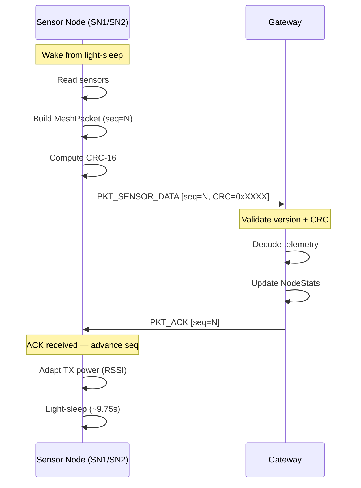
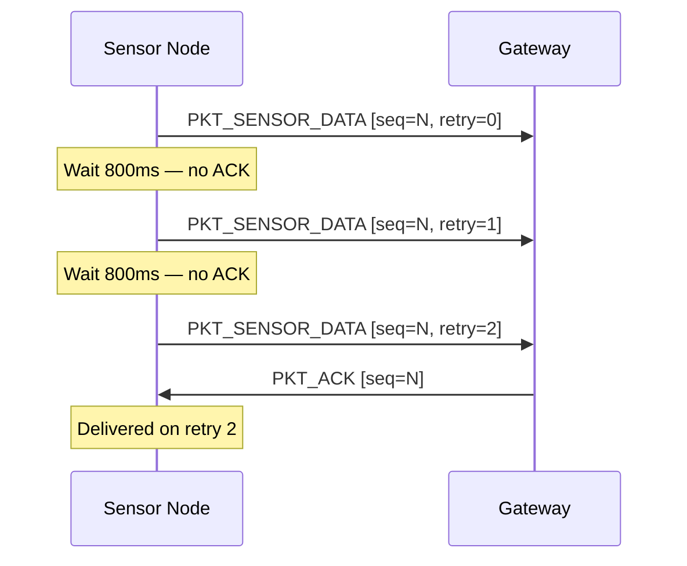
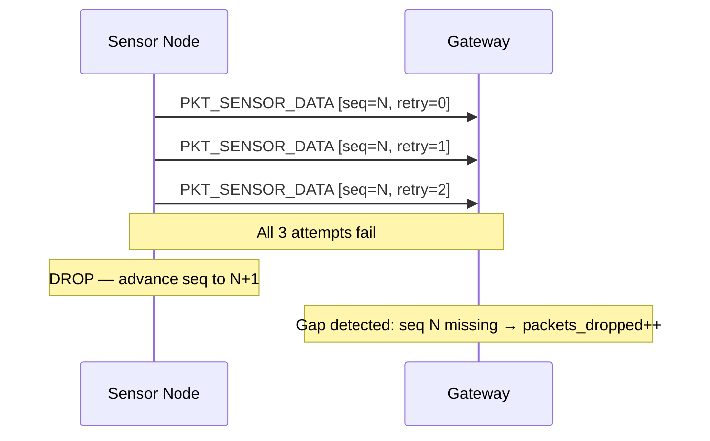
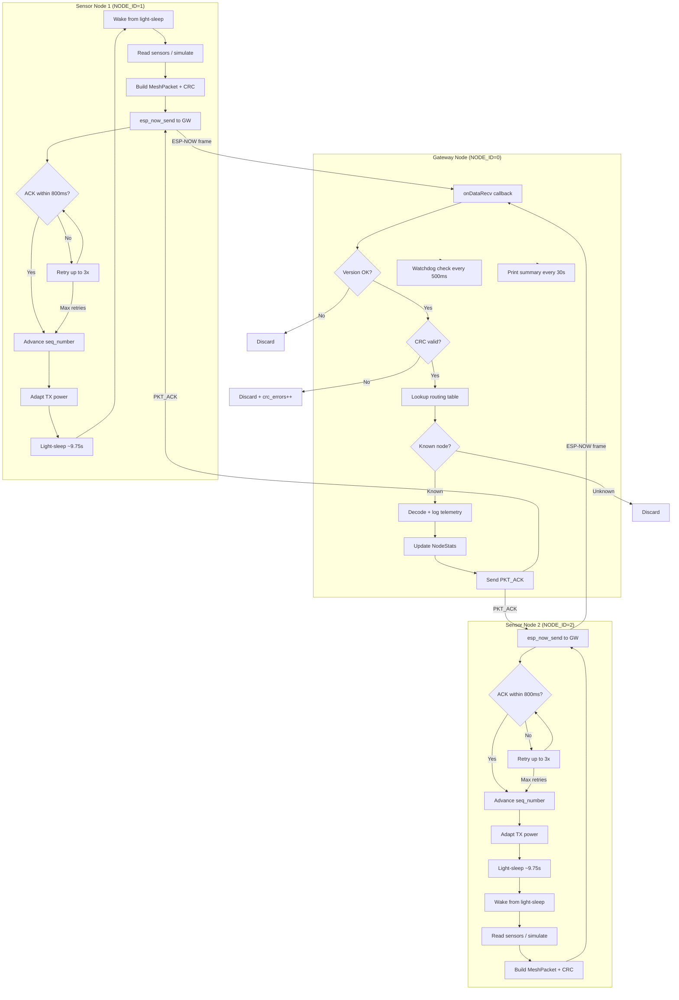
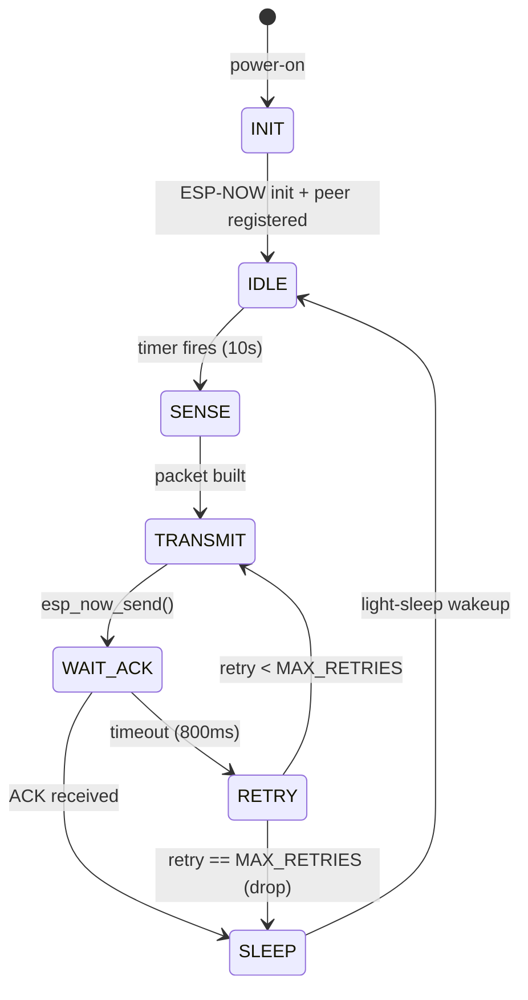
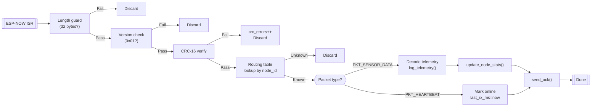
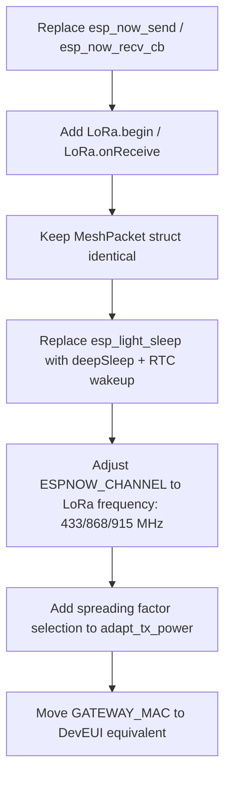

# Mountain Mesh — Low-Power Wireless Sensor Network
## ESP-NOW Based Distributed Climate Monitoring for Off-Grid Terrain

> **A bench-scale proof-of-concept simulating a rugged, multi-node sensor mesh for automated climate adaptation monitoring in infrastructure-free high-altitude environments.**

[](https://www.espressif.com/en/products/socs/esp32)
[](https://docs.espressif.com/projects/esp-idf/en/stable/esp32/api-reference/network/esp_now.html)
[](LICENSE)
[](https://github.com/espressif/arduino-esp32)

---

## Table of Contents

1. [Project Overview](#1-project-overview)
2. [System Validity & Architecture Rationale](#2-system-validity--architecture-rationale)
3. [Network Topology](#3-network-topology)
4. [Packet Structure](#4-packet-structure)
5. [Packet Flow Diagrams](#5-packet-flow-diagrams)
6. [Firmware Architecture](#6-firmware-architecture)
7. [Power Management Strategy](#7-power-management-strategy)
8. [Bill of Materials (BOM)](#8-bill-of-materials-bom)
9. [Lab Bench Testing Guide](#9-lab-bench-testing-guide)
10. [Scaling to LoRa (SX1278)](#10-scaling-to-lora-sx1278)
11. [Project File Structure](#11-project-file-structure)

---

## 1. Project Overview

Deep, steep valleys in high-altitude regions like Ladakh are beyond the reach of cellular infrastructure. Automated climate systems deployed in such terrain — monitoring glacial meltwater flow, ambient temperature, humidity, and atmospheric pressure — need a communication backbone that operates with **zero dependency on pre-existing networks**.

This project implements a **3-node localized wireless mesh** using the ESP32's native **ESP-NOW** peer-to-peer protocol. Rather than acquiring expensive LoRa hardware, the firmware architecture replicates the behaviour of a wide-area sensor network entirely in software:

| Field Deployment Concept | Bench-Scale Simulation |
|---|---|
| Sub-GHz LoRa radio links | 2.4 GHz ESP-NOW connectionless frames |
| LoRaWAN Network Server | Gateway node with per-node routing table |
| ADR (Adaptive Data Rate) | Software adaptive TX power |
| Confirmed uplinks with ACK | Application-layer PKT_ACK mechanism |
| Deep-sleep between TX windows | `esp_light_sleep_start()` duty cycle |
| Multi-hop relay nodes | `hop_count` field (table designed for extension) |
| CRC-based frame integrity | CRC-16/CCITT computed over all packet fields |

The result is firmware that a hardware reviewer can evaluate as a **genuine networking engineering artefact**, not a toy demo.

---

## 2. System Validity & Architecture Rationale

### Why ESP-NOW Is a Valid Simulation Vehicle

ESP-NOW is not merely a convenience — it shares structural properties with the LoRaWAN stack that matter for this simulation:

- **Connectionless, unidirectional by default.** Nodes do not associate or handshake. Each packet is a self-contained unit — identical to a LoRa uplink frame.
- **Fixed-length binary payloads.** The 250-byte ESP-NOW payload ceiling forces the same discipline as LoRa's tight payload budgets (up to 222 bytes at SF7/BW500).
- **No network infrastructure dependency.** ESP-NOW works in the absence of any AP, router, or the internet — matching the infrastructure-free constraint.
- **MAC-addressed peer model.** The ESP-NOW peer table is architecturally equivalent to a LoRaWAN device registry (DevAddr mapping).

### What the Firmware Adds on Top

The raw ESP-NOW API provides only MAC-layer delivery confirmation. This firmware adds the layers a real sensor network requires:

```
┌────────────────────────────────────────────────┐
│  Application Layer   ← sensor data + watchdog  │
├────────────────────────────────────────────────┤
│  Transport Layer     ← seq numbers, ACK, retry │
├────────────────────────────────────────────────┤
│  Network Layer       ← node_id routing table   │
├────────────────────────────────────────────────┤
│  MAC / Radio Layer   ← ESP-NOW / LoRa PHY      │
└────────────────────────────────────────────────┘
```

---

## 3. Network Topology

```
  REMOTE TERRAIN (simulated on bench)
  ┌────────────────────────────────────────────────────────┐
  │                                                        │
  │   ┌──────────────┐         ┌──────────────┐           │
  │   │  SENSOR NODE │         │  SENSOR NODE │           │
  │   │     SN1      │         │     SN2      │           │
  │   │  (NODE_ID=1) │         │  (NODE_ID=2) │           │
  │   │              │         │              │           │
  │   │ Flow meter   │         │ Flow meter   │           │
  │   │ Temp/Humid   │         │ Temp/Humid   │           │
  │   │ Barometer    │         │ Barometer    │           │
  │   │ Battery mon  │         │ Battery mon  │           │
  │   └──────┬───────┘         └──────┬───────┘           │
  │          │   ESP-NOW (2.4GHz)     │                   │
  │          │   PKT_SENSOR_DATA ──►  │                   │
  │          │   ◄── PKT_ACK          │                   │
  │          │                        │                   │
  │          └──────────┬─────────────┘                   │
  │                     │ ESP-NOW                         │
  │                     ▼                                  │
  │           ┌──────────────────┐                        │
  │           │  GATEWAY NODE    │                        │
  │           │   (NODE_ID=0)    │                        │
  │           │                  │                        │
  │           │ Routing table    │                        │
  │           │ Per-node stats   │                        │
  │           │ CRC validation   │                        │
  │           │ Watchdog alarm   │                        │
  │           │ Serial telemetry │                        │
  │           └────────┬─────────┘                        │
  │                    │ (future: MQTT / SD / BLE)        │
  └────────────────────┼───────────────────────────────── ┘
                       │
                  [Serial Monitor]
                  [SD Card / Cloud]
```

### Node Roles

| Node | ID | Role | MAC Slot |
|---|---|---|---|
| Sensor Node 1 | 1 | Transmit telemetry, sleep between cycles | `SN1_MAC` |
| Sensor Node 2 | 2 | Transmit telemetry, sleep between cycles | `SN2_MAC` |
| Gateway | 0 | Receive, validate, ACK, log | `GATEWAY_MAC` |

---

## 4. Packet Structure

Every frame on the wire is a **32-byte packed C struct**. The layout is fixed and versioned — `protocol_version` guards against mismatched firmware.

```
 Byte  0    1    2    3    4─5    6─9    10   11   12─13  14─15
      ┌────┬────┬────┬────┬──────┬──────┬────┬────┬──────┬──────┐
      │VER │TYPE│NID │HOP │ SEQ  │ TIME │FLGS│RSSI│ FLOW │ TEMP │
      └────┴────┴────┴────┴──────┴──────┴────┴────┴──────┴──────┘
       1B   1B   1B   1B    2B     4B    1B   1B    2B     2B

 Byte 16─17  18─21    22─23    24    25    26─27  28─31
      ┌──────┬────────┬────────┬────┬────┬───────┬──────────┐
      │HUMID │PRESSURE│BATT_MV │TXPW│RETR│ CRC16 │ RESERVED │
      └──────┴────────┴────────┴────┴────┴───────┴──────────┘
        2B      4B       2B      1B   1B    2B       4B
                                                Total: 32 bytes
```

### Field Reference

| Field | Type | Offset | Encoding | Notes |
|---|---|---|---|---|
| `protocol_version` | `uint8_t` | 0 | literal | `0x01` = v1 |
| `packet_type` | `uint8_t` | 1 | enum | `0x01`=data, `0x02`=ACK, `0x03`=HB |
| `node_id` | `uint8_t` | 2 | literal | 0=gateway, 1–254=nodes |
| `hop_count` | `uint8_t` | 3 | counter | future multi-hop use |
| `seq_number` | `uint16_t` | 4 | rolling | wraps 65535→0 |
| `timestamp_ms` | `uint32_t` | 6 | `millis()` | source node uptime |
| `sensor_flags` | `uint8_t` | 10 | bitmask | which sensors are valid |
| `rssi_last_hop` | `int8_t` | 11 | signed dBm | link quality feedback |
| `flow_rate_mLs` | `uint16_t` | 12 | ×10 fixed-pt | 125 = 12.5 mL/s |
| `temperature_c10` | `int16_t` | 14 | ×10 fixed-pt | −153 = −15.3 °C |
| `humidity_pct10` | `uint16_t` | 16 | ×10 fixed-pt | 634 = 63.4% |
| `pressure_pa` | `uint32_t` | 18 | Pascals | raw, no scaling |
| `battery_mv` | `uint16_t` | 22 | mV | supply voltage |
| `tx_power_dbm` | `uint8_t` | 24 | dBm | current TX setting |
| `retry_count` | `uint8_t` | 25 | counter | retransmissions |
| `crc16` | `uint16_t` | 26 | CRC-16/CCITT | over bytes 0–25 |
| `reserved` | `uint8_t[4]` | 28 | zero | future expansion |

### Sensor Flags Bitmask

```
  Bit 7  6  5  4  3       2          1         0
      ─  ─  ─  ─  ─  ──────────  ─────────  ────────
                       BARO_ACT   HUMID_ACT  FLOW_ACT  TEMP_ACT
                         (×8)       (×4)       (×2)      (×1)
```

---

## 5. Packet Flow Diagrams

### 5.1 Normal Uplink with ACK



### 5.2 Retry on Missed ACK



### 5.3 Packet Drop Scenario



### 5.4 Full System Architecture



---

## 6. Firmware Architecture

### Sensor Node State Machine



### Gateway Event Pipeline



---

## 7. Power Management Strategy

The firmware implements a **duty-cycled operation** pattern that directly mirrors field LoRa node behaviour:

| Phase | Duration | Current (approx.) |
|---|---|---|
| Active (sense + TX) | ~250 ms | ~80 mA |
| Light-sleep | ~9,750 ms | ~1.5–3 mA |
| **Weighted average** | — | **~3.5 mA** |

At 3.5 mA average from a 2500 mAh LiPo cell, a field node runs for approximately **700 hours (29 days)** between charges — viable for a seasonal deployment with solar top-up.

### Adaptive TX Power

After each ACK, the gateway RSSI is fed back into the sensor node via `rssi_last_hop`. The firmware adjusts TX power in three tiers:

| RSSI | TX Power | Saving |
|---|---|---|
| > −50 dBm (excellent) | 8 dBm | ~40% vs max |
| −50 to −65 dBm (good) | 14 dBm | ~20% vs max |
| < −65 dBm (weak) | 20 dBm (max) | baseline |

This mirrors LoRaWAN's ADR (Adaptive Data Rate) mechanism.

---

## 8. Bill of Materials (BOM)

| # | Component | Qty | Unit Cost (approx.) | Notes |
|---|---|---|---|---|
| 1 | ESP32 Dev Board (30-pin, 4MB flash) | 3 | ₹350 / $4.20 | Any ESP32 variant works |
| 2 | USB-A to Micro-USB cable | 3 | ₹80 / $1.00 | For flashing + serial monitor |
| 3 | USB Hub or 3× USB ports on PC | 1 | — | Power all 3 simultaneously |
| 4 | Breadboard (optional) | 1 | ₹60 / $0.75 | For future peripheral wiring |
| 5 | Jumper wires (optional) | 10 | ₹40 / $0.50 | For future I2C sensor wiring |
| **Total (bench PoC)** | | | **~₹1,180 / ~$14** | |

### Future Field BOM (LoRa Migration)

| Component | Purpose |
|---|---|
| Ra-02 / AI-Thinker SX1278 433 MHz | Sub-GHz long-range radio |
| SHT31 (I2C) | Temperature + Humidity sensor |
| BMP280 (SPI/I2C) | Barometric pressure |
| YF-S201 Hall-effect flow sensor | Meltwater flow measurement |
| 18650 LiPo + TP4056 charger | Field power supply |
| 6V 2W Solar panel | Trickle charge in daylight |
| IP67 enclosure | High-altitude weatherproofing |

---

## 9. Lab Bench Testing Guide

### Prerequisites

- Arduino IDE 2.x **or** PlatformIO (VSCode)
- Arduino ESP32 Core **v2.x or later** (`espressif/arduino-esp32`)
- Three ESP32 development boards
- Three USB cables + three USB ports on your workstation

---

### Step 1 — Install Dependencies

**Arduino IDE:**
1. File → Preferences → Additional Board URLs:
   ```
   https://raw.githubusercontent.com/espressif/arduino-esp32/gh-pages/package_esp32_index.json
   ```
2. Tools → Board Manager → search `esp32` → install **esp32 by Espressif Systems v2.x**

**PlatformIO** (`platformio.ini`):
```ini
[env:esp32dev]
platform = espressif32
board = esp32dev
framework = arduino
monitor_speed = 115200
```

---

### Step 2 — Read MAC Addresses

Flash the following minimal sketch to all three boards one at a time:

```cpp
#include <WiFi.h>
void setup() {
    Serial.begin(115200);
    WiFi.mode(WIFI_STA);
    Serial.println(WiFi.macAddress());
}
void loop() {}
```

Note down the three MAC addresses:
```
Gateway: XX:XX:XX:XX:XX:XX   ← paste into GATEWAY_MAC in sensor_node.cpp
SN1    : XX:XX:XX:XX:XX:XX   ← paste into SN1_MAC in gateway_node.cpp
SN2    : XX:XX:XX:XX:XX:XX   ← paste into SN2_MAC in gateway_node.cpp
```

---

### Step 3 — Configure MAC Addresses

In **`sensor_node.cpp`**, find:
```cpp
static const uint8_t GATEWAY_MAC[6] = {0xAA, 0xBB, 0xCC, 0xDD, 0xEE, 0x00};
```
Replace with the gateway board's actual MAC bytes.

In **`gateway_node.cpp`**, find:
```cpp
static const uint8_t SN1_MAC[6] = {0xAA, 0xBB, 0xCC, 0xDD, 0xEE, 0x01};
static const uint8_t SN2_MAC[6] = {0xAA, 0xBB, 0xCC, 0xDD, 0xEE, 0x02};
```
Replace with the sensor nodes' actual MAC bytes.

---

### Step 4 — Flash the Boards

**Gateway first** (so it is ready to receive the initial heartbeat):
1. Select Board: `ESP32 Dev Module`
2. Select Port: (gateway's COM port)
3. Open `gateway_node.cpp`, compile and upload
4. Open Serial Monitor at **115200 baud** — you should see:
   ```
   ╔══════════════════════════════════════╗
   ║  Mountain Mesh — GATEWAY NODE        ║
   ╚══════════════════════════════════════╝
   [NET] Gateway MAC : AA:BB:CC:DD:EE:00
   [NET] Listening for sensor nodes...
   ```

**Sensor Node 1:**
1. Open `sensor_node.cpp`
2. Ensure `#define NODE_ID 1` is set (or pass `-DNODE_ID=1`)
3. Select SN1's COM port, upload
4. Serial Monitor should show:
   ```
   ╔══════════════════════════════════════╗
   ║  Mountain Mesh — Sensor Node 1       ║
   ╚══════════════════════════════════════╝
   [NET] Heartbeat sent — beginning duty cycle
   ```

**Sensor Node 2:**
1. Change `#define NODE_ID 2` (or `-DNODE_ID=2`)
2. Select SN2's COM port, upload

---

### Step 5 — Verify Multi-Node Operation

Open **three Serial Monitor windows** simultaneously (Arduino IDE supports one at a time; use PlatformIO, CoolTerm, or `screen` on Linux/macOS for three concurrent monitors).

**Expected gateway output (per 10s cycle):**
```
[RX] DATA  node=1  seq=3  RSSI=-42 dBm
┌─────────────────────────────────────────────────┐
│ TELEMETRY  Node:1    Seq:3     Hop:0    RSSI:-42 dBm
├─────────────────────────────────────────────────┤
│  Flow Rate  :   12.6 mL/s
│  Temperature:   -4.3 °C
│  Humidity   :   71.8 %
│  Pressure   :  72489 Pa  (~2706 m ASL)
│  Battery    : 3297 mV   TX Power: 8 dBm
│  Retries    : 0        CRC: 0xA3F2
└─────────────────────────────────────────────────┘
[ACK] → Node 1  seq=3
```

**Expected sensor node output:**
```
─────────────────────────────────────────
  [PKT] node=1  seq=3  type=0x01  hop=0
  flow=12.6 mL/s  temp=-4.3°C  humid=71.8%  press=72489 Pa
  batt=3297 mV  RSSI_gw=-42 dBm  retries=0  CRC=0xA3F2
─────────────────────────────────────────
[TX] MAC-layer delivery confirmed (seq=3)
[RX] ACK received from gateway for seq=3  RSSI=-42 dBm
[PWR] TX power set to 8 dBm (RSSI=-42 dBm)
[PWR] Light-sleep for 9746 ms
```

**Every 30 seconds, the gateway prints:**
```
╔══════════════ NETWORK STATUS SUMMARY ══════════════╗
║  Node 1  | ONLINE  | RX:12    | DUP:0   | DROP:0  ║
║           RSSI avg:-43.2  min:-48  max:-38  LastRX:4s ago
║  Node 2  | ONLINE  | RX:11    | DUP:0   | DROP:1  ║
║           RSSI avg:-45.7  min:-52  max:-40  LastRX:8s ago
╚════════════════════════════════════════════════════╝
```

---

### Step 6 — Simulate Packet Loss

To verify the retry and drop counters:
1. Power off Sensor Node 1 mid-cycle.
2. Watch the gateway print `[ALARM] Node 1 went OFFLINE` after 60 s.
3. Power it back on — verify it resumes from a new `seq_number` and the gateway correctly increments `packets_dropped` for the gap.

---

## 10. Scaling to LoRa (SX1278)

The firmware's layered architecture makes the migration straightforward. Only the **radio abstraction layer** changes — all packet structure, routing logic, and power management carry over unchanged.

### Migration Checklist



### Code-Level Mapping

| ESP-NOW (current) | LoRa SX1278 (target) |
|---|---|
| `esp_now_send(mac, buf, len)` | `LoRa.beginPacket(); LoRa.write(buf, len); LoRa.endPacket()` |
| `esp_now_register_recv_cb(cb)` | `LoRa.onReceive(cb)` |
| `esp_wifi_set_max_tx_power(p)` | `LoRa.setTxPower(p)` |
| `ESPNOW_CHANNEL = 1` | `LoRa.begin(433E6)` (433 MHz) |
| `esp_light_sleep_start()` | `esp_deep_sleep_start()` + `LoRa.sleep()` |
| MAC-layer delivery status | `LoRa.parsePacket()` + manual ACK |
| RSSI from `rx_ctrl->rssi` | `LoRa.packetRssi()` |

### Recommended Library

```
arduino-LoRa by sandeepmistry
https://github.com/sandeepmistry/arduino-LoRa
```

---

## 11. Project File Structure

```
mountain-mesh/
├── sensor_node/
│   └── sensor_node.cpp       ← Sensor node firmware (flash to SN1 and SN2)
├── gateway_node/
│   └── gateway_node.cpp      ← Gateway firmware (flash to GW board)
├── README.md                 ← This file
└── LICENSE                   ← MIT License
```

### Building with PlatformIO

```
mountain-mesh/
├── sensor_node/
│   ├── platformio.ini
│   └── src/main.cpp          ← rename sensor_node.cpp to main.cpp
└── gateway_node/
    ├── platformio.ini
    └── src/main.cpp          ← rename gateway_node.cpp to main.cpp
```

`sensor_node/platformio.ini`:
```ini
[env:esp32dev]
platform    = espressif32
board       = esp32dev
framework   = arduino
build_flags = -DNODE_ID=1    ; change to 2 for the second sensor node
monitor_speed = 115200
```

---

## Contributing

Pull requests welcome. Key areas for extension:
- Persistent telemetry logging to SD card (SPI)
- BLE characteristic exposure for ranger tablet readout
- Dynamic node discovery (auto-add unknown `node_id` to routing table)
- HMAC-SHA256 packet authentication (replace bare CRC)
- OTA firmware update via gateway relay

---

## License

MIT License © Kartikey, NIT Goa. See [LICENSE](LICENSE) for details.
