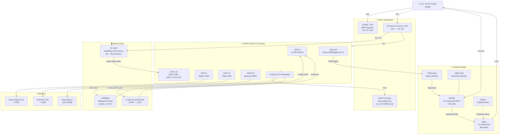

# 🧊 Ice Stupa Autonomous Freeze Prevention System
## Hardware Specification & Wiring Guide

**Document Version:** 1.0.0
**Last Updated:** June 2026
**Status:** ✅ Verified — Bench Tested
**Target Platform:** ESP32 DevKit V1 (30-pin)
**License:** MIT

---

> **Scope:** This document is the authoritative hardware reference for the Ice Stupa Autonomous Freeze Prevention System. It covers component selection rationale, full electrical specifications, GPIO pin assignments, point-to-point wiring instructions, and critical safety constraints. All firmware described in `src/main.cpp` is written against the hardware topology defined here. Do not modify pin assignments without updating both this document and the firmware constants.

---

## 📋 Table of Contents

1. [System Hardware Overview](#1-system-hardware-overview)
2. [Hardware Block Diagram](#2-hardware-block-diagram)
3. [Bill of Materials (BOM)](#3-bill-of-materials-bom)
4. [Absolute Pin Mapping Table](#4-absolute-pin-mapping-table)
5. [Point-to-Point Wiring Netlist](#5-point-to-point-wiring-netlist)
6. [Critical Hardware Safety Notes](#6-critical-hardware-safety-notes)
7. [Power Budget Analysis](#7-power-budget-analysis)
8. [Revision History](#8-revision-history)

---

## 1. 🔧 System Hardware Overview

### 1.1 Architecture Philosophy

The hardware architecture of this system is designed around a core principle applicable to all safety-critical embedded deployments in hostile environments: **minimize single points of failure, default to the safest possible electrical state, and protect the control system from its own actuators.**

The system employs a **dual-modality sensing strategy** — combining a thermal sensor (DS18B20) for early freeze-risk detection with a kinetic sensor (YF-S201) for definitive blockage confirmation. Neither sensor alone is sufficient: temperature alone cannot confirm a mechanical blockage has occurred, and flow rate alone cannot predict an *imminent* freeze. Together, they form a robust, redundant detection layer.

### 1.2 Component Selection Rationale

| Subsystem | Chosen Component | Key Design Reason |
|---|---|---|
| **Microcontroller** | ESP32 DevKit V1 | Dual-core Xtensa LX6, hardware interrupt support on all GPIOs, integrated Wi-Fi for future telemetry, 3.3V logic, deep-sleep capability for power-managed deployments |
| **Temperature Sensing** | DS18B20 Waterproof Probe | 1-Wire protocol minimizes GPIO usage; ±0.5°C accuracy from −10°C to +85°C; stainless steel housing rated for direct water immersion; parasite-power capable (used in 3-wire mode for reliability) |
| **Flow Sensing** | YF-S201 Hall-Effect Sensor | Non-intrusive rotating impeller with hall-effect output; pulse-based output is immune to analog noise; operates on 5V with open-drain output, compatible with 3.3V MCU via `INPUT_PULLUP` |
| **Actuation** | DN15 12V Motorized Ball Valve | Full-bore design minimizes pressure drop during normal operation; 12V DC motor is readily controllable via MOSFET switching; spring-return variants available for fail-open operation |
| **Gate Driver** | IRF520 N-Channel MOSFET | Logic-level compatible at 3.3V Vgs (confirmed: Vgs(th) ≤ 2V for logic-level IRF520N variants); rated 10A continuous drain current — substantial headroom over the valve's ~1–2A peak; TO-220 package dissipates heat without heatsink at these currents |
| **Inductive Protection** | 1N4007 Rectifier Diode | Standard flyback diode for DC inductive loads; 1A rated, 1000V PIV — far exceeds the ~50V inductive kickback expected from a 12V motor; fast enough for DC switching applications |
| **Rail Stabilisation** | 1000µF/25V Electrolytic | Bulk decoupling capacitor to suppress the 1–2A inrush current transient during valve actuation, preventing supply droop on the 12V rail that would otherwise brownout the 5V/3.3V logic rails |

### 1.3 Voltage Domain Summary

This system operates across **three discrete voltage domains** that must never be cross-connected without level shifting or protection:

```
┌─────────────────────────────────────────────────────┐
│  DOMAIN A: 12V DC — Valve Actuator Power            │
│  DOMAIN B: 5V DC  — YF-S201 VCC, ESP32 VIN/USB     │
│  DOMAIN C: 3.3V DC — ESP32 GPIO Logic, DS18B20 VCC  │
│                                                     │
│  ⚠️  GPIO pins on the ESP32 are NOT 5V-tolerant.    │
│     YF-S201 signal line is compatible ONLY because  │
│     it is open-drain and pulled up by INPUT_PULLUP  │
│     to the ESP32's internal 3.3V rail, not 5V.      │
└─────────────────────────────────────────────────────┘
```

---

## 2. 📊 Hardware Block Diagram

The following diagram shows the complete hardware topology of the system. Power flows from top to bottom; signal flows are shown with directional arrows.



> **Diagram Notes:**
> - Dashed lines (`-.->`) represent protection/clamping paths, not signal paths.
> - All ground connections share a **common ground** plane. Both the logic ground (ESP32 GND) and the power ground (12V supply GND) must be tied together at a single star-ground point.
> - The `10kΩ` pull-down on the MOSFET gate ensures the valve is de-energised (CLOSED) in the event of a GPIO going high-impedance on MCU reset.

---

## 3. 🗒️ Bill of Materials (BOM)

### 3.1 Core Components

| # | Component | Specification / Rating | Role in Circuit | Qty |
|---|---|---|---|---|
| 1 | **ESP32 DevKit V1** | Xtensa LX6 dual-core, 240MHz; 3.3V I/O; 30-pin DIP footprint; integrated Wi-Fi 802.11 b/g/n; 34 usable GPIOs | Primary microcontroller — runs state machine, reads sensors, drives actuator | 1 |
| 2 | **DS18B20 Waterproof Probe** | 1-Wire digital; −55°C to +125°C range; ±0.5°C accuracy (−10 to +85°C); 9–12 bit resolution; stainless steel TO-92 housing; 1m cable | In-pipe fluid temperature measurement | 1 |
| 3 | **YF-S201 Flow Rate Sensor** | 5V DC; 1–30 L/min range; hall-effect turbine impeller; 450 ±10% pulses/L; 3-wire (VCC, GND, SIG) | Pipe flow velocity monitoring — confirms blockage or stall | 1 |
| 4 | **DN15 12V Motorized Ball Valve** | 12V DC motor; DN15 (½ inch BSP) bore; 5–7s travel time; ≤1.5A running current; ~2A inrush; 0.8–1.0MPa rated working pressure | Primary fluid control actuator — opens/closes pipeline on firmware command | 1 |
| 5 | **IRF520 N-Channel MOSFET** | Vds = 100V; Id = 10A; Vgs(th) = 2.0–4.0V (logic-level variants: ≤2V); Rds(on) ≈ 0.27Ω; TO-220 package | Low-side switch for 12V valve motor — driven directly from 3.3V GPIO | 1 |

### 3.2 Passive & Protection Components

| # | Component | Specification / Rating | Role in Circuit | Qty |
|---|---|---|---|---|
| 6 | **1N4007 Rectifier Diode** | 1A forward current; 1000V PIV; ~1.1V Vf; DO-41 package | Flyback suppression diode — clamps inductive voltage spikes from valve motor back-EMF | 1 |
| 7 | **Electrolytic Capacitor** | 1000µF / 25V; low-ESR preferred; radial lead | Bulk energy reservoir — suppresses 12V rail droop during valve actuation inrush | 1 |
| 8 | **Ceramic Capacitor** | 100nF (0.1µF) / 16V minimum; X7R or X5R dielectric | High-frequency decoupling on ESP32 3.3V supply pin; placed physically close to VCC pin | 1 |
| 9 | **Resistor — Pull-up** | 4.7kΩ, 1/4W, ±1% | 1-Wire bus pull-up from DS18B20 DATA to 3.3V; required by Dallas 1-Wire spec | 1 |
| 10 | **Resistor — Gate Series** | 220Ω, 1/4W, ±5% | MOSFET gate series resistor — limits gate charging current, reduces ringing on gate trace | 1 |
| 11 | **Resistor — Gate Pull-down** | 10kΩ, 1/4W, ±5% | MOSFET gate pull-down to GND — ensures valve de-energises during ESP32 boot/reset | 1 |
| 12 | **Resistor — LED Current Limit** | 220Ω, 1/4W, ±5% | Current limiting for status and alert LEDs (3.3V − 2.0V Vf) / 0.02A ≈ 65Ω min; 220Ω used for longevity | 2 |

### 3.3 Indicators & Peripherals

| # | Component | Specification / Rating | Role in Circuit | Qty |
|---|---|---|---|---|
| 13 | **LED — Green (5mm)** | 2.0–2.2V Vf; 20mA max | System status indicator — blinks during MONITORING state | 1 |
| 14 | **LED — Red (5mm)** | 1.8–2.0V Vf; 20mA max | Alert indicator — solid during FLUSHING; SOS pattern during CRITICAL_ALERT | 1 |
| 15 | **Piezo Buzzer (Active)** | 3–5V; 85dB @ 10cm; 12mA max | Audible alert on state transitions and faults | 1 |
| 16 | **SSD1306 OLED (Optional)** | 128×64 px; I2C (0x3C); 3.3–5V; 20mA max | Real-time display of state, temperature, and flow rate (optional peripheral) | 1 |

### 3.4 Power & Interconnect

| # | Component | Specification / Rating | Role in Circuit | Qty |
|---|---|---|---|---|
| 17 | **12V / 3A DC Power Supply** | 36W; regulated; centre-positive 5.5/2.1mm barrel; ±5% regulation | Main system power source for valve and stepped-down logic supply | 1 |
| 18 | **12V → 5V Buck Converter** | LM2596-based or MP1584; input 12V; output 5V/2A; ≥85% efficiency | Steps 12V down to 5V for ESP32 VIN and YF-S201 VCC | 1 |
| 19 | **Breadboard / Perfboard** | 830-tie (prototyping) or 7×9cm double-sided perfboard (semi-permanent) | Prototyping substrate | 1 |
| 20 | **Jumper Wire Set / Hook-up Wire** | 22AWG solid core (perfboard) or 28AWG stranded (breadboard) | Interconnects | — |
| 21 | **Barrel Jack Connector** | 5.5/2.1mm PCB-mount; rated 5A | 12V DC input terminal | 1 |
| 22 | **Terminal Block (2-pin, 5mm pitch)** | 5A rated; 5mm pitch screw terminal | Valve motor connection — allows secure, removable connection to motor wires | 2 |

---

## 4. 📍 Absolute Pin Mapping Table

> ⚠️ **Caution:** The ESP32 has several GPIOs with boot-time restrictions. GPIOs 0, 2, 5, 12, and 15 have internal pull resistors that are sampled at boot and can affect the boot process if externally driven. All GPIOs in this design have been selected to **avoid boot-sensitive pins**.

| GPIO | Direction | Signal Name | Connected To | Electrical Requirement | Special Function Used | Boot-Safe? |
|---|---|---|---|---|---|---|
| **GPIO 4** | Bidirectional | `TEMP_DATA` | DS18B20 Data pin | 4.7kΩ pull-up to 3.3V — **must not be omitted**; bus idles HIGH | 1-Wire protocol (SW bit-bang via DallasTemperature lib) | ✅ Yes |
| **GPIO 18** | Input | `FLOW_PULSE` | YF-S201 Yellow (Signal) wire | `INPUT_PULLUP` — internal ~45kΩ pull-up provides open-drain compatibility with 3.3V logic; sensor VCC is 5V but signal is open-drain | Hardware Interrupt — `IRAM_ATTR` ISR on `FALLING` edge | ✅ Yes |
| **GPIO 26** | Output | `VALVE_CTRL` | 220Ω resistor → IRF520 Gate | Active-HIGH, push-pull 3.3V output; 10kΩ external pull-down to GND ensures gate is LOW during boot | Digital / PWM capable (LEDC) — used as digital output in v1.0 | ✅ Yes |
| **GPIO 2** | Output | `LED_STATUS` | 220Ω resistor → Green LED → GND | Active-HIGH, 3.3V push-pull; 220Ω limits current to ~5.9mA | Digital output; shares onboard LED on DevKit V1 | ⚠️ Boot LED — safe for output use after boot |
| **GPIO 25** | Output | `BUZZER_PWM` | Piezo Buzzer + → GND | Active-HIGH, 3.3V; PWM `tone()` compatible | DAC-capable pin; PWM via LEDC for tone generation | ✅ Yes |
| **GPIO 27** | Output | `LED_ALERT` | 220Ω resistor → Red LED → GND | Active-HIGH, 3.3V push-pull; 220Ω limits current to ~5.9mA | Digital output | ✅ Yes |
| **GPIO 21** | Bidirectional | `I2C_SDA` | SSD1306 OLED SDA *(optional)* | I2C data; 4.7kΩ pull-up to 3.3V (usually onboard the module) | Hardware I2C peripheral (I2C0) | ✅ Yes |
| **GPIO 22** | Output | `I2C_SCL` | SSD1306 OLED SCL *(optional)* | I2C clock; 4.7kΩ pull-up to 3.3V | Hardware I2C peripheral (I2C0) | ✅ Yes |
| **3.3V** | Power Out | `VCC_3V3` | DS18B20 Red (VCC), 4.7kΩ pull-up top rail | Max 600mA from onboard LDO; DS18B20 draws ~1.5mA typical | Onboard AMS1117-3.3 LDO regulator output | — |
| **5V / VIN** | Power In | `VCC_5V` | Buck converter output, YF-S201 Red (VCC) | 5V input from buck converter; also powers onboard LDO | USB/VIN power input | — |
| **GND** | Power | `GND` | All component grounds — **star topology** | Common reference for all three voltage domains | Ground plane | — |

### 4.1 Reserved / Unused Pins — Constraints

| GPIO | Constraint | Reason |
|---|---|---|
| GPIO 0 | **Do not drive LOW during power-on** | Boot mode select — external pull-down forces ROM bootloader |
| GPIO 12 | **Do not pull HIGH during power-on** | Sets flash voltage — high at boot enables 1.8V flash, causing boot failure on 3.3V flash modules |
| GPIO 34–39 | **Input only — no internal pull resistors** | These GPIOs have no output drivers or internal pull-ups; cannot drive loads or use `INPUT_PULLUP` |
| GPIO 6–11 | **Do not use** | Connected to internal SPI flash memory — any interference will corrupt flash |

---

## 5. 🔌 Point-to-Point Wiring Netlist

All wiring instructions below assume a **single common GND** reference. Establish this first before connecting any other net.

### ⚠️ Pre-Wiring Checklist

- [ ] Power supply is **unplugged** from mains
- [ ] ESP32 is **not connected** to USB
- [ ] Multimeter set to continuity mode — verify GND bus has no shorts to 3.3V or 5V rails before powering up
- [ ] Identify all component pin-outs before insertion (DS18B20 flat/curved face orientation, MOSFET Gate/Drain/Source markings)

---

### BLOCK A — Power Distribution

This block establishes all three voltage rails. Complete this block and verify voltages with a multimeter before connecting any other components.

```
A1. MAIN INPUT
    Barrel Jack (+) terminal        → 12V supply (+) rail (red bus)
    Barrel Jack (−) terminal        → Common GND bus (black bus)

A2. BULK DECOUPLING (12V Rail)
    1000µF/25V Capacitor (+) lead   → 12V supply (+) rail
    1000µF/25V Capacitor (−) lead   → Common GND bus
    ⚠️  Observe polarity — reversed electrolytic capacitors will fail violently.

A3. BUCK CONVERTER (12V → 5V)
    Buck Converter VIN (+)          → 12V supply (+) rail
    Buck Converter VIN (−)          → Common GND bus
    Buck Converter VOUT (+)         → 5V rail (orange bus)
    Buck Converter VOUT (−)         → Common GND bus
    🔧  Adjust buck converter trim pot until VOUT reads exactly 5.0V ± 0.1V
        on a multimeter BEFORE connecting any loads.

A4. ESP32 POWER INPUT
    ESP32 VIN pin                   → 5V rail (orange bus)
    ESP32 GND pin (any GND pin)     → Common GND bus
    ✅  After connecting, verify 3.3V appears on the ESP32 3.3V output pin.

A5. 3.3V DECOUPLING (ESP32 Logic Rail)
    100nF Ceramic Cap (−)           → Common GND bus
    100nF Ceramic Cap (+)           → ESP32 3.3V output pin
    ℹ️  Place this capacitor physically as close as possible to the ESP32
        3.3V pin. This suppresses high-frequency switching noise.

    ✅  VERIFICATION CHECKPOINT:
        Before proceeding, measure and confirm:
          • 12V rail: 11.8V – 12.2V ✓
          • 5V rail:   4.9V –  5.1V ✓
          • 3.3V rail: 3.2V –  3.4V ✓
          • 0V continuity between all GND nodes ✓
```

---

### BLOCK B — Temperature Sensor (DS18B20)

The DS18B20 waterproof probe has a cable with three wires. Wire colour conventions vary by manufacturer — **verify with your sensor's datasheet.** The most common convention is:

> 🔴 Red = VCC | ⬛ Black = GND | 🟡 Yellow (or White) = DATA

```
B1. DS18B20 POWER
    DS18B20 Red wire (VCC)          → ESP32 3.3V output pin
    DS18B20 Black wire (GND)        → Common GND bus
    ⚠️  Use 3-wire (powered) mode, NOT parasite power mode.
        Parasite power is unreliable at 12-bit resolution due to
        high current demand during temperature conversion (~1.5mA).

B2. DS18B20 DATA LINE
    DS18B20 Yellow/White (DATA)     → ESP32 GPIO 4
    
B3. 1-WIRE PULL-UP RESISTOR (MANDATORY)
    4.7kΩ resistor — one end        → ESP32 3.3V output pin
    4.7kΩ resistor — other end      → ESP32 GPIO 4 (same node as DATA wire)

    ℹ️  This resistor provides the idle-HIGH state required by the
        Dallas 1-Wire protocol. Without it, reads will fail or return
        garbage data. The node formed by GPIO4 + DATA wire + 4.7kΩ
        should measure 3.3V at idle (sensor not pulling it low).

    ✅  VERIFICATION: Disconnect ESP32 from power. Measure resistance
        between GPIO4 and 3.3V pin. Should read ~4.7kΩ. ✓
```

---

### BLOCK C — Flow Rate Sensor (YF-S201)

The YF-S201 has three wires:

> 🔴 Red = VCC (5V) | ⬛ Black = GND | 🟡 Yellow = Signal (open-drain pulse)

```
C1. YF-S201 POWER
    YF-S201 Red wire (VCC)          → 5V rail (orange bus)
    YF-S201 Black wire (GND)        → Common GND bus
    ⚠️  The YF-S201 requires 5V VCC — do NOT connect to 3.3V.
        The hall-effect IC inside is powered at 5V. However, the
        signal output is open-drain and safe for 3.3V MCU input
        when INPUT_PULLUP is used (see C2 below).

C2. YF-S201 SIGNAL LINE
    YF-S201 Yellow wire (Signal)    → ESP32 GPIO 18
    
    ℹ️  No external pull-up required. The firmware configures GPIO18
        as INPUT_PULLUP, which activates the ESP32's internal ~45kΩ
        pull-up resistor to 3.3V. Since the signal wire is open-drain,
        the sensor pulls it LOW on each impeller blade pass, generating
        a FALLING edge that triggers the hardware ISR.

    ✅  VERIFICATION: With 5V applied and water flowing through the
        sensor, GPIO18 should show a square wave (0V / 3.3V) on an
        oscilloscope or toggle audibly on a continuity tester.
```

---

### BLOCK D — MOSFET / Valve Actuation Stage

This is the highest-voltage block. Triple-check all connections before applying power. The IRF520 in TO-220 package has three pins, viewed from the **front (marked face)**:

```
  TO-220 Pin Layout (viewed from front):
  ┌─────────────────┐
  │  GATE  DRAIN  SOURCE │
  │   [1]   [2]   [3]   │
  └─────────────────┘
  (Tab/heatsink = DRAIN)
```

```
D1. MOSFET GATE DRIVE
    220Ω resistor — one end         → ESP32 GPIO 26
    220Ω resistor — other end       → IRF520 Gate (Pin 1)
    
    10kΩ pull-down resistor (end A) → IRF520 Gate (Pin 1) — same node
    10kΩ pull-down resistor (end B) → Common GND bus
    
    ℹ️  The 220Ω series resistor limits gate charging current and
        damps ringing caused by gate capacitance and trace inductance.
        The 10kΩ pull-down is non-negotiable — it prevents valve
        actuation during ESP32 power-up/reset when GPIO26 is 
        high-impedance (floating).

D2. MOSFET SOURCE
    IRF520 Source (Pin 3)           → Common GND bus
    ⚠️  Source must connect to the same GND as the 12V supply return.
        Do not use a separate ground for the valve circuit.

D3. FLYBACK DIODE (MANDATORY — install before connecting valve)
    1N4007 Diode CATHODE (stripe)   → 12V supply (+) rail
    1N4007 Diode ANODE              → IRF520 Drain (Pin 2 / tab)
    
    ⚠️  This is a protection component, not a signal component.
        It must be connected with correct polarity. Installing it
        backwards will short the 12V rail to GND and destroy
        components. Verify: diode stripe (cathode) faces the + rail.
    
    ℹ️  In normal operation, current flows: 12V → Valve → Drain → Source → GND.
        The diode is reverse-biased and non-conducting.
        When the MOSFET switches OFF, the valve's inductor generates
        a spike of opposite polarity. The diode becomes forward-biased,
        providing a current path that clamps the spike and prevents
        it from reaching the MOSFET.

D4. VALVE MOTOR CONNECTION
    12V supply (+) rail              → Valve Motor (+) terminal (via terminal block)
    IRF520 Drain (Pin 2)             → Valve Motor (−) terminal (via terminal block)
    
    ℹ️  The valve motor is a DC motor — polarity determines rotation
        direction (open vs. close). For 2-wire valves, reversing these
        wires will cause the valve to run in the opposite direction.
        Test with GPIO26 HIGH briefly to confirm the valve opens.
        If it closes instead, swap the two motor wires.

    ✅  VERIFICATION (with 12V applied, ESP32 running self-test):
        • GPIO26 LOW  → Valve motor silent, 0V across motor terminals ✓
        • GPIO26 HIGH → Valve motor runs, 12V across motor terminals  ✓
        • On GPIO26 falling edge: no audible pop from power supply,
          no ESP32 reset → inductive protection is functioning ✓
```

---

### BLOCK E — Indicators

```
E1. STATUS LED (Green)
    ESP32 GPIO 2                    → 220Ω resistor → Green LED (Anode)
    Green LED (Cathode)             → Common GND bus
    ℹ️  GPIO2 also drives the onboard blue LED on DevKit V1 boards.
        Both will illuminate together — this is expected behaviour.

E2. ALERT LED (Red)
    ESP32 GPIO 27                   → 220Ω resistor → Red LED (Anode)
    Red LED (Cathode)               → Common GND bus

E3. PIEZO BUZZER
    ESP32 GPIO 25                   → Piezo Buzzer (+) terminal
    Piezo Buzzer (−) terminal       → Common GND bus
    ℹ️  Active buzzers (with internal oscillator) will beep at any DC level.
        Passive buzzers require a PWM signal from tone() to make sound.
        This firmware uses tone() — use a passive piezo buzzer.

E4. OLED DISPLAY (Optional)
    SSD1306 VCC                     → ESP32 3.3V output pin
    SSD1306 GND                     → Common GND bus
    SSD1306 SDA                     → ESP32 GPIO 21
    SSD1306 SCL                     → ESP32 GPIO 22
    ℹ️  Most SSD1306 modules include onboard I2C pull-up resistors.
        Do not add additional external pull-ups — this will create
        a resistor divider that can cause I2C communication errors.
```

---

## 6. ⚠️ Critical Hardware Safety Notes

### 🔴 SAFETY NOTE 1 — Flyback Diode: Mandatory Inductive Protection

When the MOSFET switches the valve motor **OFF**, the motor's coil inductance resists the sudden change in current. By Lenz's Law, it generates a back-EMF (also called a flyback spike) of **opposite polarity and potentially very high voltage** — easily 50V to 100V on a 12V DC circuit, despite the low supply voltage.

**Without the 1N4007:**
- This spike appears directly across the MOSFET's Drain-Source terminals
- The IRF520 has a Vds(max) of 100V — the spike *may* exceed this threshold
- Even below breakdown, repeated spikes degrade the MOSFET gate oxide
- Voltage spikes couple capacitively to the ESP32's GPIO rails and can cause random resets, bit errors, or permanent GPIO damage

**With the 1N4007 (correctly installed):**
- The spike is clamped to `V_supply + V_forward` ≈ `12V + 0.7V = 12.7V`
- Current circulates through the motor → diode → back to motor until the energy dissipates as heat
- The MOSFET and all GPIO lines see only the supply voltage

> 🔑 **Rule:** The flyback diode must be installed as physically close to the valve motor terminals as possible, with the shortest possible leads. Long leads add inductance, reducing clamping effectiveness.

---

### 🔴 SAFETY NOTE 2 — Bulk Capacitor: Preventing Logic Brownouts

The DN15 valve motor draws approximately **1.5A steady-state** and up to **2A during inrush** for the first 50–100ms of actuation.

If the ESP32 and valve share the same power supply without bulk decoupling, the inrush current creates a **transient voltage droop** on the supply rail. The ESP32's onboard AMS1117-3.3 LDO requires a minimum input of ~3.6V. If the 5V rail droops below this — even momentarily — the ESP32 will reset, potentially:
- Losing the current system state
- Failing to complete the valve actuation
- Entering a reset/actuate loop that hammers the valve

**The 1000µF capacitor acts as a local charge reservoir:** during the inrush transient (typically 50–100ms), it sources current from its stored charge, preventing the rail from drooping. Its energy storage (`E = ½CV²`) is `E = ½ × 0.001 × 144 = 72mJ` — more than sufficient for this transient duration.

> 🔑 **Placement Rule:** Install the 1000µF capacitor with leads no longer than 2cm from the 12V rail's positive and negative nodes. ESR (Equivalent Series Resistance) of the capacitor lead resistance adds to effective resistance and reduces its ability to source current quickly.

---

### 🟡 SAFETY NOTE 3 — MOSFET Logic-Level Compatibility

The IRF520 is an older MOSFET with a gate threshold voltage (Vgs(th)) specified as 2.0–4.0V in standard datasheets. Driving this gate with 3.3V from the ESP32 falls **at the lower edge of the threshold band**, creating a risk of the MOSFET operating in its linear (partially-on) region rather than being fully saturated.

**Symptoms of an undersaturated MOSFET:**
- MOSFET runs hot even at low duty cycles
- Voltage drop across Drain-Source is significant (>0.5V when should be ~0.27V × 1.5A ≈ 0.4V)
- Valve may operate erratically

**Mitigation Strategy:**
1. **Source Selection:** Specify **IRF520N** (not generic IRF520) — the "N" variant is specified for logic-level gate drive and has Vgs(th) ≤ 2.0V, ensuring full enhancement at 3.3V.
2. **Alternative Drop-in:** `IRLZ44N` (Vgs(th) ≤ 1.0V, Id = 47A) is a superior logic-level alternative with the same TO-220 footprint and no code changes required.
3. **Verification:** After wiring, measure Vgs with MOSFET fully driven. It should read 3.0–3.3V. Measure Vds — it should be <0.5V with the valve running. If Vds > 1V, the MOSFET is not fully saturating; switch to the IRLZ44N.

---

### 🟡 SAFETY NOTE 4 — GPIO 5V Tolerance

> **The ESP32's GPIO pins are NOT 5V tolerant.** Maximum safe input voltage on any GPIO is **3.6V**.

The YF-S201 operates at 5V but its signal output is **open-drain** — it can only pull the line LOW; it cannot drive it HIGH above the pull-up voltage. By using `INPUT_PULLUP` on GPIO18, the ESP32's internal 45kΩ pull-up connects the signal line to the ESP32's own 3.3V rail. The sensor never drives this line above 3.3V.

**This compatibility is dependent on the open-drain characteristic. Never connect a push-pull 5V signal directly to an ESP32 GPIO.** A resistor voltage divider (e.g., 10kΩ / 20kΩ) or a dedicated level-shifter IC (e.g., TXS0102) is required for push-pull 5V signals.

---

### 🟡 SAFETY NOTE 5 — Star Grounding

All ground connections in this system must form a **star topology**, converging to a single physical point. This prevents ground loops and differential voltages between the logic and power grounds, which can cause:
- False sensor readings
- MOSFET gate voltage being referenced to a floating ground
- EMI coupling into 1-Wire and flow sensor signal lines

> 🔑 **Recommended approach:** Use a single short, heavy-gauge (20AWG) wire from the power supply's negative terminal to a central GND node on the breadboard or perfboard. All other ground connections radiate from this single point.

---

## 7. 📊 Power Budget Analysis

This section verifies that the chosen power supply (12V/3A, 36W) and buck converter (5V/2A, 10W) are adequately sized with appropriate margins.

| Load | Supply Rail | Typical Current | Peak / Inrush Current | Notes |
|---|---|---|---|---|
| ESP32 DevKit V1 | 5V (via VIN) | 80mA | 500mA (Wi-Fi active) | If Wi-Fi telemetry is added, account for 500mA peak |
| DS18B20 | 3.3V | 1.5mA | 1.5mA | Negligible; supplied from ESP32 onboard LDO |
| YF-S201 | 5V | 15mA | 15mA | Steady-state; negligible |
| Status/Alert LEDs | 3.3V | 6mA each | 6mA each | 220Ω limiting, ~5.9mA per LED |
| Piezo Buzzer | 3.3V | 12mA | 12mA | Active only during alert events |
| SSD1306 OLED (opt.) | 3.3V | 20mA | 20mA | Optional — powered via ESP32 LDO |
| **5V Rail Total** | **5V** | **~125mA** | **~560mA** | Well within 2A buck converter limit |
| DN15 Motorized Valve | 12V | 1,500mA | ~2,000mA | Dominant load; only active during FLUSHING/EXERCISE states |
| **12V Rail Total** | **12V** | **~1,625mA** | **~2,200mA** | Supply rated 3A — **27% headroom at peak** ✅ |

> **Conclusion:** The 12V/3A supply is adequately sized. The 1000µF bulk capacitor provides the inrush transient buffering required to keep the 12V rail stable during valve actuation. The 5V buck converter has approximately 74% current headroom — sufficient even if Wi-Fi telemetry is activated.

---

## 8. 📝 Revision History

| Version | Date | Author | Changes |
|---|---|---|---|
| 1.0.0 | June 2026 | *[Your Name]* | Initial release — complete hardware specification for bench prototype |

---

## 📎 Related Documents

| Document | Description |
|---|---|
| `README.md` | Project overview, motivation, and quick-start guide |
| `src/main.cpp` | Complete state machine firmware (C++ / Arduino Framework) |
| `docs/FIRMWARE_ARCHITECTURE.md` | State machine design, transition logic, and firmware constants |
| `docs/TESTING_LOG.md` | Bench test results, oscilloscope captures, and calibration data |
| `hardware/schematic.kicad_sch` | KiCad schematic source file |
| `hardware/schematic.pdf` | Exported schematic for quick reference |

---

<div align="center">

**Ice Stupa Autonomous Freeze Prevention System**
*Open-source hardware and firmware for high-altitude cold-weather fluid control*

[](https://opensource.org/licenses/MIT)
[](https://www.espressif.com/)
[](https://www.arduino.cc/)

</div>
