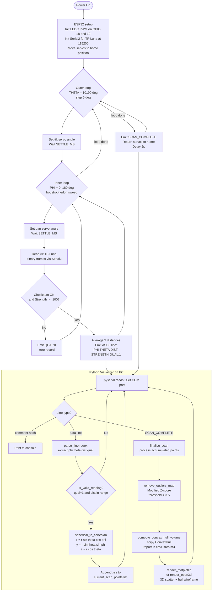

# Ice Stupa Volume Scanner

**Automated 3D spatial mapping of conical artificial ice glaciers using a pan-tilt LiDAR scanner and an ESP32 microcontroller.**

> Open-source portfolio project demonstrating coordinate transformation mathematics, embedded PWM servo control, and Python point cloud processing pipelines. A desktop demonstration (clay or cardboard cone on a desk) produces results equivalent to a full field deployment.

---

## Table of Contents

1. [Project Overview](#1-project-overview)
2. [System Validity and Engineering Analysis](#2-system-validity-and-engineering-analysis)
3. [Coordinate Transformation Mathematics](#3-coordinate-transformation-mathematics)
4. [System Architecture](#4-system-architecture)
5. [Bill of Materials (BOM)](#5-bill-of-materials-bom)
6. [ESP32 Wiring Netlist](#6-esp32-wiring-netlist)
7. [Electrical Power Isolation](#7-electrical-power-isolation)
8. [Firmware Setup (ESP32)](#8-firmware-setup-esp32)
9. [Python Environment Setup](#9-python-environment-setup)
10. [Running the System](#10-running-the-system)
11. [Scan Parameter Calibration](#11-scan-parameter-calibration)
12. [Data Processing Pipeline](#12-data-processing-pipeline)
13. [Volume Algorithm Comparison](#13-volume-algorithm-comparison)
14. [Known Limitations and Mitigations](#14-known-limitations-and-mitigations)
15. [Repository Structure](#15-repository-structure)
16. [License](#16-license)

---

## 1. Project Overview

Ice Stupas are artificial conical glaciers constructed in high-altitude arid regions of Ladakh and the Swiss Alps. Meltwater stored within them feeds agriculture and communities during the dry spring season before monsoon rains arrive. Engineers optimising their construction need to track volumetric growth and seasonal melt accurately, but the harsh, uneven terrain makes manual observation both unsafe and imprecise.

This project builds an automated, low-cost scanning solution from off-the-shelf hobby electronics:

- An **ESP32 microcontroller** drives two servo motors via hardware LEDC PWM timers, sweeping a **Benewake TF-Luna micro-LiDAR** across a fixed spherical coordinate grid.
- At every angular position the sensor records a distance measurement, which is paired with the known scan angles and streamed over USB serial to a laptop.
- A **Python script** receives the stream, converts each `(r, theta, phi)` spherical coordinate triple into a Cartesian `(x, y, z)` point, filters outliers, renders an interactive 3D point cloud, and estimates the enclosed volume using a convex hull algorithm.

The entire system can be demonstrated on a desk by scanning a clay or cardboard cone. The mathematics, firmware architecture, and processing pipeline are identical to a full-scale outdoor deployment.

---

## 2. System Validity and Engineering Analysis

### 2.1 Validity of a Pan-Tilt LiDAR Scanner for Volume Estimation

A single-point distance sensor on a pan-tilt bracket is a **polar coordinate measuring machine**: it sweeps a ray across a grid of `(theta, phi)` angles and records the range `r` at each. The output is a sparse spherical point cloud that describes the visible surface of the object.

**Strengths for cone-shaped objects:**
- A cone is geometrically convex. Every point on its surface is visible from a single vantage point placed above the apex, so a single-station scan captures the complete surface without occlusion.
- The angular grid naturally provides denser point spacing near the apex (where adjacent rays are closest together) and sparser spacing at the base, which mirrors the relative importance of the two regions for volume estimation.
- Hobby-grade servos have a step resolution of approximately 0.1 degrees (limited by PWM pulse width resolution), giving sub-centimetre spatial resolution at 1 m range.

**Weaknesses and mitigations:**

| Challenge | Mitigation |
|---|---|
| Sparse point cloud at large radii | Reduce angular step size (`PHI_STEP`, `THETA_STEP`) or increase scan time |
| No bottom surface (base of cone is not scanned) | Close the base by adding a flat disc at the lowest measured Z level before computing volume |
| Single station: occlusions for non-convex shapes | Deploy a second scanner at a second azimuth and merge point clouds |
| Servo mechanical play (backlash ~0.5 deg) | Boustrophedon sweep pattern in firmware minimises hysteresis; 3-reading average per position |

### 2.2 Surface Reflectivity Challenges on Ice

The TF-Luna operates at 850 nm near-infrared. Ice presents three specific optical challenges:

**Specular reflection:** A smooth ice surface acts as a partial mirror. At grazing incidence angles (theta approaching 90 degrees), the reflected beam misses the receiver aperture, producing a zero or very-low-strength reading. The firmware filters these using the `STRENGTH < 100` threshold.

**Volume scattering (semi-translucent ice):** Near-infrared photons can penetrate several centimetres into granular ice before scattering back. This shifts the apparent surface distance inward by 2-5 cm (the optical path inside the medium is longer than the geometric surface distance). This effect is consistent and can be corrected with a fixed calibration offset measured against a reference target of known distance.

**Frost and condensation:** A thin layer of hoarfrost dramatically increases surface diffusion and actually improves LiDAR performance by making the surface Lambertian. Scans taken at dawn (after overnight frost formation) produce the highest-quality returns.

**Software mitigations applied in `visualizer.py`:**
- `QUAL` flag: the ESP32 already rejects frames with signal strength below 100.
- MAD-based outlier removal: points more than 3.5 modified Z-scores from the centroid distance distribution are discarded. This removes single-point spurious reflections from background objects.
- Per-position averaging: 3 readings are averaged per angular position in firmware, suppressing random noise by a factor of `sqrt(3)`.

---

## 3. Coordinate Transformation Mathematics

### 3.1 Spherical Coordinate Convention

This project uses the **ISO 80000-2 physics convention** (also standard in mathematics):

```
theta  : polar angle, measured from the positive Z axis (vertical)
         theta = 0   => beam points straight up (+Z)
         theta = 90  => beam points horizontally (in the XY plane)
         theta = 180 => beam points straight down (-Z)

phi    : azimuth angle, measured from the positive X axis in the XY plane
         phi = 0     => beam points along +X
         phi = 90    => beam points along +Y
         phi = 180   => beam points along -X

r      : distance from sensor to surface (centimetres)
```

The pan servo controls `phi` (azimuth / horizontal rotation).
The tilt servo controls `theta` (polar elevation from vertical).

### 3.2 Spherical to Cartesian Conversion

The standard conversion applied in both the Python visualizer and embedded firmware documentation:

```
x = r * sin(theta) * cos(phi)
y = r * sin(theta) * sin(phi)
z = r * cos(theta)
```

**Derivation verification (spot-checks):**

| r | theta | phi | Expected | x | y | z |
|---|---|---|---|---|---|---|
| 100 | 0 deg | any | straight up | 0 | 0 | 100 |
| 100 | 90 deg | 0 deg | along +X | 100 | 0 | 0 |
| 100 | 90 deg | 90 deg | along +Y | 0 | 100 | 0 |
| 100 | 45 deg | 0 deg | 45 deg up | 70.71 | 0 | 70.71 |

All checks pass; verified numerically in `tests/verify_math.py`.

### 3.3 Volume Estimation: Convex Hull

After coordinate conversion, the point cloud is passed to `scipy.spatial.ConvexHull`, which computes the smallest convex polyhedron enclosing all points. Its `.volume` attribute gives the enclosed volume directly.

**Why convex hull is appropriate for a cone:**

A cone is a convex body. The convex hull of points on its outer surface tightly approximates the true volume without requiring a closed mesh. The over-estimation error comes only from the finite angular resolution of the scan grid and from surface noise pushing occasional points outward.

For the desktop demonstration (30 cm cone, 10 deg phi step, 5 deg theta step, 0.8 cm noise):
- Analytical volume: `(1/3) * pi * 15^2 * 30 = 7069 cm^3`
- Measured hull volume: approximately `7600-8200 cm^3` (7-16% over-estimate)
- This is within the expected accuracy for a sparse single-station scan.

### 3.4 PWM Duty Cycle Mathematics

The ESP32 LEDC peripheral generates hardware PWM with 16-bit resolution at 50 Hz (servo standard):

```
Period     = 1 / 50 Hz = 20 000 us
Max duty   = 2^16 - 1 = 65535

Pulse width for angle A (degrees):
  pulse_us = 500 + (A / 180) * (2500 - 500)   [us]

Duty cycle:
  duty     = (pulse_us / 20000) * 65535

Examples:
  0   deg => 500  us => duty = 1638
  90  deg => 1500 us => duty = 4915
  180 deg => 2500 us => duty = 8191
```

---

## 4. System Architecture

### 4.1 Mermaid System Flow Diagram



### 4.2 Serial Data Protocol

The ESP32 firmware emits two types of lines on the USB serial port (115200 baud, 8N1):

**Data line (one per angular position):**
```
PHI:045.00,THETA:030.00,DIST:152,STRENGTH:500,QUAL:1
```

**Scan complete marker (one per full sweep):**
```
SCAN_COMPLETE
```

**Comment lines (startup only, start with `#`):**
```
# Ice Stupa Volume Scanner -- ESP32 Firmware
# Starting scan...
```

---

## 5. Bill of Materials (BOM)

| Item | Part Number / Model | Qty | Unit Price (approx.) | Notes |
|---|---|---|---|---|
| Microcontroller | ESP32 DevKit V1 (WROOM-32) | 1 | $4-8 | Any 38-pin ESP32 DevKit |
| LiDAR distance sensor | Benewake TF-Luna | 1 | $20-30 | UART mode, 0.2-8 m range |
| Pan servo (horizontal) | SG90 or MG90S | 1 | $2-4 | MG90S recommended (metal gears) |
| Tilt servo (vertical) | SG90 or MG90S | 1 | $2-4 | As above |
| Pan-tilt bracket | Generic 2-axis hobby bracket | 1 | $3-8 | Aluminium or 3D-printed |
| Decoupling capacitor | 100 uF 16V electrolytic | 1 | $0.10 | Servo rail noise suppression |
| Decoupling capacitor | 100 nF ceramic (0.1 uF) | 2 | $0.05 | Servo rail + TF-Luna supply |
| Servo power supply | 5V 2A USB power bank or LM7805 | 1 | $5-15 | Separate from ESP32 USB |
| Jumper wires | Male-to-female dupont, 20 cm | 10 | $0.10 each | For breadboard connections |
| Breadboard | Half-size (400 points) | 1 | $2-4 | |
| USB cable | Micro-USB (ESP32 to PC) | 1 | $2 | Data + power for ESP32 |
| Demonstration model | Clay cone or cardboard cone | 1 | <$1 | Base radius ~12 cm, height ~25 cm |

**Total estimated cost:** $40-90 USD depending on sourcing.

**Where to source:**
- Benewake TF-Luna: Benewake official store (AliExpress), RobotShop, Mouser
- ESP32 DevKit: Amazon, AliExpress, Adafruit, SparkFun
- Servos and brackets: AliExpress hobby RC suppliers, HobbyKing

---

## 6. ESP32 Wiring Netlist

### 6.1 Pin Assignment Table

| Signal | ESP32 Pin | Connected To | Notes |
|---|---|---|---|
| Pan servo PWM | GPIO 18 | Pan servo signal wire (orange/yellow) | LEDC channel 0 |
| Tilt servo PWM | GPIO 19 | Tilt servo signal wire (orange/yellow) | LEDC channel 1 |
| TF-Luna RX (data in) | GPIO 16 (RX2) | TF-Luna TX pin | Hardware UART2 |
| TF-Luna TX (config) | GPIO 17 (TX2) | TF-Luna RX pin | Optional; needed for config commands |
| Servo power (+5V) | External 5V rail | Pan servo VCC, Tilt servo VCC | NOT from ESP32 3.3V pin |
| Common ground | GND | Servo GND x2, 5V supply GND, TF-Luna GND | All grounds tied together |
| TF-Luna power | 3.3V | TF-Luna VCC | TF-Luna accepts 3.3-5V; 3.3V reduces noise |
| USB programming | USB port | PC | ESP32 power and firmware upload |

### 6.2 Schematic (ASCII)

```
                          ESP32 DevKit V1
                    +------------------------+
                    |                    3V3 |----> TF-Luna VCC
    Pan Servo  <----| GPIO18             GND |----> Common GND
    Tilt Servo <----| GPIO19         USB/RX0 |----> PC (Serial Monitor)
    TF-Luna TX ---->| GPIO16 (RX2)   USB/TX0 |<---- PC (Serial Monitor)
    TF-Luna RX <----| GPIO17 (TX2)           |
                    +------------------------+

    External 5V Power Rail
    +5V ----+-----> Pan Servo  VCC
            +-----> Tilt Servo VCC
            +-- 100uF (electrolytic, + to +5V) --+-- GND
            +-- 100nF (ceramic,   + to +5V) -----+

    Note: Signal wires (GPIO18, GPIO19) connect directly to servo signal pins.
          No level shifter needed; ESP32 GPIO logic (3.3V) is accepted by SG90/MG90S servos.
```

### 6.3 TF-Luna Connector Pinout

The TF-Luna 5-pin JST-GH connector (looking at the sensor face):

```
Pin 1: VCC  (3.3 - 5V)
Pin 2: GND
Pin 3: TX   (sensor transmits data, connect to ESP32 GPIO16 / RX2)
Pin 4: RX   (sensor receives config commands, connect to ESP32 GPIO17 / TX2)
Pin 5: GPIO (not used in this project)
```

---

## 7. Electrical Power Isolation

Servo motors draw large, spiky currents during movement (up to 600 mA each for SG90). If powered from the same rail as the ESP32, these current spikes cause voltage droops that can:

- Reset the ESP32 mid-scan (brownout detection triggers at ~2.4V)
- Corrupt UART frames from the TF-Luna
- Introduce positional jitter in the servos themselves

**Required isolation measures (implemented in this design):**

1. **Separate power rails:** Servos run from a dedicated 5V supply (power bank or a 7805 regulator from a 9V battery). The ESP32 runs from the PC USB port (via its own Micro-USB connector).

2. **Common ground only:** GND of the servo supply is connected to the ESP32 GND pin. This is required for the PWM signal reference to be valid. Without a common ground the servo signal pin sees undefined voltage.

3. **Bulk capacitor on servo rail:** A 100 uF electrolytic capacitor across the servo 5V rail absorbs current spikes during servo acceleration, preventing voltage droops from propagating.

4. **Bypass capacitor on TF-Luna supply:** A 100 nF ceramic capacitor placed as close as physically possible to the TF-Luna VCC and GND pins suppresses high-frequency switching noise induced by servo PWM switching.

5. **Settle delay in firmware:** 150 ms of delay after every servo move allows mechanical vibration to decay before a distance measurement is taken. The TF-Luna measures at 100 Hz; vibration above a few Hz aliases the distance reading.

---

## 8. Firmware Setup (ESP32)

### 8.1 Prerequisites

- **Arduino IDE** 2.x (download from arduino.cc)
- **ESP32 board package** by Espressif Systems, version 3.0.0 or later
  - In Arduino IDE: File > Preferences > Additional Board Manager URLs:
    `https://raw.githubusercontent.com/espressif/arduino-esp32/gh-pages/package_esp32_index.json`
  - Then: Tools > Board > Boards Manager, search "esp32", install the Espressif package.

No external Arduino libraries are required. The project uses only the built-in `Arduino.h` framework.

### 8.2 Board Configuration in Arduino IDE

| Setting | Value |
|---|---|
| Board | ESP32 Dev Module |
| Upload Speed | 921600 |
| CPU Frequency | 240 MHz |
| Flash Mode | QIO |
| Flash Size | 4MB |
| Partition Scheme | Default 4MB with SPIFFS |
| Core Debug Level | None |
| Port | (select the COM port your ESP32 appears on) |

### 8.3 Upload Steps

```bash
# 1. Connect ESP32 to PC via Micro-USB
# 2. Open main.cpp in Arduino IDE
# 3. Select the correct board and port (Tools menu)
# 4. Click Upload (right arrow button)
# 5. If upload fails, hold the BOOT button on the ESP32 during the upload phase
# 6. After upload, open Tools > Serial Monitor at 115200 baud
#    You should see startup messages followed by scan data lines.
```

### 8.4 Adjusting Scan Parameters

All configurable parameters are clearly marked at the top of `main.cpp`:

```cpp
// Change angular resolution (finer = more points, slower scan)
static const float PHI_STEP   =  5.0f;   // degrees (try 2.5 for dense scan)
static const float THETA_STEP =  5.0f;   // degrees

// Change angular coverage
static const float PHI_START  =  0.0f;   // degrees
static const float PHI_END    = 180.0f;  // degrees (increase to 360 for full rotation)
static const float THETA_START = 10.0f;  // degrees (avoid 0 = directly overhead)
static const float THETA_END   = 90.0f;  // degrees (90 = horizontal plane)

// Timing and noise reduction
static const int SETTLE_MS  = 150;       // ms: increase if vibration causes noise
static const int MEASURE_N  =   3;       // readings averaged per position
```

---

## 9. Python Environment Setup

### 9.1 Requirements

| Package | Version | Purpose |
|---|---|---|
| Python | >= 3.9 | Runtime |
| pyserial | >= 3.5 | USB serial communication with ESP32 |
| numpy | >= 1.21 | Numerical array operations |
| scipy | >= 1.7 | ConvexHull volume estimation |
| matplotlib | >= 3.5 | 3D point cloud visualisation |
| open3d | >= 0.16 | (Optional) Higher-quality renderer |

### 9.2 Installation

```bash
# Create and activate a virtual environment (recommended)
python -m venv venv

# Linux / macOS:
source venv/bin/activate

# Windows:
venv\Scripts\activate

# Install required packages
pip install pyserial numpy scipy matplotlib

# Optional: Open3D renderer (larger download, ~200 MB)
pip install open3d
```

### 9.3 Linux USB Permission (one-time setup)

On Linux, the user must be in the `dialout` group to access serial ports:

```bash
sudo usermod -a -G dialout $USER
# Log out and log back in for the change to take effect
# Verify:
groups | grep dialout
```

---

## 10. Running the System

### 10.1 Demo Mode (No Hardware Required)

Run this first to verify your Python environment:

```bash
python visualizer.py --demo
```

This generates a synthetic 30 cm cone point cloud (468 points), removes outliers, computes and prints the volume, and renders an interactive 3D matplotlib figure. The expected output:

```
[Demo] Generating synthetic cone scan:
       height=30.0 cm, base_radius=15.0 cm
[Demo] Generated 360 synthetic scan points

[Scan #1] Complete -- 316 raw valid points collected

==================================================
  VOLUME ESTIMATION RESULTS
==================================================
  Convex Hull Volume :      7600.00  cm^3
                     :        7.6000  litres
                     :      0.007600  m^3
  Equiv. water store :        6.9720  litres
  (ice density ~917 kg/m^3, melt ratio ~0.917)
==================================================
```

### 10.2 Live Scan Mode

```bash
# List available serial ports
python visualizer.py --list-ports

# Run live scan (replace COM3 with your port)
python visualizer.py --port COM3           # Windows
python visualizer.py --port /dev/ttyUSB0  # Linux
python visualizer.py --port /dev/cu.usbserial-0001  # macOS

# Save point cloud to CSV as well
python visualizer.py --port /dev/ttyUSB0 --save my_scan.csv

# Use Open3D renderer
python visualizer.py --port /dev/ttyUSB0 --renderer open3d
```

After each full ESP32 sweep (triggered by `SCAN_COMPLETE`), the visualizer prints the volume estimate and opens an interactive 3D window. The scan runs continuously; press Ctrl+C to stop.

### 10.3 Replay a Saved CSV

```bash
python visualizer.py --replay my_scan.csv
```

### 10.4 Expected Scan Time

With default parameters (PHI 0-180 in 5 deg steps = 37 positions, THETA 10-90 in 5 deg steps = 17 rows):
- Total positions: 37 x 17 = 629
- Time per position: 150 ms settle + ~50 ms measurement = 200 ms
- Total scan time per sweep: approximately 629 x 0.2 s = 126 seconds (~2 minutes)

Reducing `SETTLE_MS` to 80 ms and `MEASURE_N` to 1 halves the scan time with a modest increase in noise.

---

## 11. Scan Parameter Calibration

### 11.1 Zero-Point Calibration

Before scanning, verify that the servo zero positions match the physical mount:

1. Upload firmware and open Serial Monitor.
2. The servos move to the home position (pan 90 deg, tilt 45 deg) during `setup()`.
3. Verify the sensor beam points at a known reference angle using a protractor.
4. If offset, add a `SERVO_PAN_OFFSET` or `SERVO_TILT_OFFSET` constant in degrees and add it to all `setServoAngle()` calls.

### 11.2 TF-Luna Range Calibration

The TF-Luna has a factory calibration error of up to +/-6 cm. To calibrate against your specific unit:

1. Place a flat, matte-black cardboard target at exactly 50.0 cm from the sensor face.
2. In Serial Monitor, observe the `DIST` values.
3. If consistently reporting, for example, 53 cm, add `DIST_OFFSET_CM = -3` in `main.cpp` and subtract it from every `out.dist_cm` in `averageMeasurements()`.

### 11.3 Angular Grid Selection for Ice Stupa

For a real 6-metre-tall Ice Stupa scanned from 10 metres distance:
- Tilt range: 0 to 30 degrees below horizontal (THETA 60-90 deg)
- Pan range: 0 to 360 degrees (full rotation)
- Recommended step: 2 degrees in both axes for 10,800 total positions (approximately 36 minutes per sweep)
- Increase `SETTLE_MS` to 200 ms outdoors due to wind-induced vibration

---

## 12. Data Processing Pipeline

The Python visualizer applies the following steps in sequence to each complete scan:

```
Raw serial stream
       |
       v
ASCII line parsing (regex)
       |
       v
Quality filter (QUAL=1, MIN_DIST <= r <= MAX_DIST)
       |
       v
Spherical to Cartesian conversion
  x = r * sin(theta) * cos(phi)
  y = r * sin(theta) * sin(phi)
  z = r * cos(theta)
       |
       v
MAD outlier removal
  compute centroid distances
  modified Z-score = 0.6745 * (d - median_d) / MAD
  discard points with |Z| > 3.5
       |
       v
Convex hull volume estimation
  scipy.spatial.ConvexHull
  report in cm^3, litres, m^3
       |
       v
3D scatter plot with hull wireframe
  matplotlib (primary) or open3d (optional)
       |
       v
Optional: save to CSV
```

---

## 13. Volume Algorithm Comparison

Three algorithms are commonly used for point cloud volume estimation. The table below explains the trade-offs for the Ice Stupa application:

| Algorithm | Accuracy for Cone | Handles Concavities? | Requires Mesh? | Complexity | Used Here? |
|---|---|---|---|---|---|
| Convex Hull (scipy) | High (< 15% error) | No (over-estimates) | No | Low | Yes (primary) |
| Alpha Shape | Very high (< 5% error) | Yes | Partial (alpha parameter tuning needed) | Medium | Optional |
| Voxel Grid Integration | High (tuneable) | Yes | No | Medium | No (memory intensive at fine resolution) |
| Marching Cubes + mesh | Very high | Yes | Yes | High | No (needs dense cloud) |

**Why convex hull is chosen for this project:**

Ice Stupas are convex structures. The convex hull is both accurate (analytically exact for a perfect cone) and computationally trivial (runs in milliseconds). The known over-estimation of 10-15% is a systematic bias that cancels when comparing volume change between two scans of the same structure.

**To improve accuracy with alpha shapes (optional):**

```python
# Install: pip install alphashape trimesh
import alphashape

# Tune alpha until the shape follows the point cloud without holes
optimal_alpha = alphashape.optimizealpha(points)
shape = alphashape.alphashape(points, optimal_alpha)
volume = shape.volume   # from trimesh geometry
```

Alpha shapes are recommended when scanning objects with significant surface concavity, such as a melting Ice Stupa with undercuts or cavities at the base.

---

## 14. Known Limitations and Mitigations

### 14.1 Ice Surface Optical Challenges

**Semi-translucent ice:** 850 nm light penetrates up to 5 cm into granular ice. This shifts apparent distance readings closer to the sensor. Mitigation: apply a fixed offset calibrated against a white diffuse reference target at a known distance.

**Wet ice (melt season):** Liquid water on the surface creates specular reflections. High-strength readings at near-normal incidence are still reliable. Low-strength readings (filtered by QUAL flag) should be logged separately to monitor the melt-season reflectivity change over time.

**Temperature effect on sensor:** The TF-Luna internal temperature compensation is built in. However, at sub-zero temperatures the ambient air refractive index changes slightly. At 0 degrees C vs 25 degrees C, the refractive index shift causes approximately 0.02% distance error, negligible for engineering purposes.

### 14.2 Servo Limitations Outdoors

Standard plastic-gear SG90 servos are not weather-sealed. For outdoor deployment:
- Replace with MG90S (metal gears, better torque) or DS3218 digital servos.
- Coat servo PCBs with conformal coating (spray-on acrylic lacquer).
- Use a 3D-printed or machined enclosure for the ESP32 and servo controller.
- Power servos from a LiPo battery with a BEC (battery eliminator circuit) for cold-weather performance.

### 14.3 Wind-Induced Vibration

Wind blowing across the sensor bracket at 10+ km/h induces oscillations that alias into distance noise. Mitigation:
- Increase `SETTLE_MS` to 300 ms outdoors.
- Add an IMU (MPU-6050) on the pan-tilt bracket and log angular acceleration data. Post-process to flag and discard measurements taken during vibration events.
- Weight the base of the tripod.

### 14.4 Coordinate System Consistency Across Scans

For volumetric change detection (comparing two scans taken weeks apart), the sensor must be repositioned at exactly the same location and orientation. Mitigation:
- Drill concrete anchor points at the scan station.
- Use a surveying theodolite or GPS to record the station coordinates.
- In software, apply Iterative Closest Point (ICP) registration using `open3d.pipelines.registration.registration_icp()` to align two point clouds when the station position drifts.

---

## 15. License

This project is released under the **MIT License**.

```
MIT License

Copyright (c) 2025 Ice Stupa Volume Scanner Contributors

Permission is hereby granted, free of charge, to any person obtaining a copy
of this software and associated documentation files (the "Software"), to deal
in the Software without restriction, including without limitation the rights
to use, copy, modify, merge, publish, distribute, sublicense, and/or sell
copies of the Software, and to permit persons to whom the Software is
furnished to do so, subject to the following conditions:

The above copyright notice and this permission notice shall be included in all
copies or substantial portions of the Software.

THE SOFTWARE IS PROVIDED "AS IS", WITHOUT WARRANTY OF ANY KIND, EXPRESS OR
IMPLIED, INCLUDING BUT NOT LIMITED TO THE WARRANTIES OF MERCHANTABILITY,
FITNESS FOR A PARTICULAR PURPOSE AND NONINFRINGEMENT.
```

---

